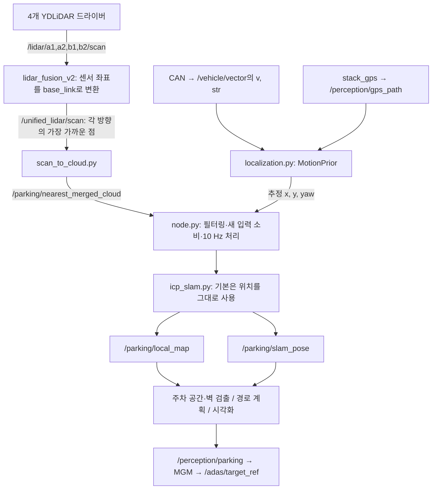

# SLAM 관련 코드 모음

2026-09-15 작업 트리 기준. 커밋하지 않은 수정도 수집 시점 그대로 포함했다.
소스와 실행 설정을 추적해 만든 검토 자료이며, 실차에서 실행 중인 노드·파라미터를 확인한 결과는 아니다.

- [전체 파일 목록](FILES.md): 역할별 원본 링크와 줄 수.
- [소스 ZIP](slam_sources.zip): 원래 디렉터리 구조를 유지한 소스·설정·테스트·참고 문서.
- [수집 명세](manifest.json): 기준 Git 커밋, 파일별 SHA-256, 크기, 줄 수.

## 먼저 알아야 할 현재 동작

**기본 주차 노드는 차량 속도·조향과 GPS로 위치를 추정하고, 그 위치에 라이다 점을 쌓는다.**
`slam`이라는 이름이 붙어 있지만 기본 설정에서는 라이다 맵 정합으로 위치를 보정하지 않는다.

- [parking_params.yaml](../../src/stack_parking/config/parking_params.yaml)의 `icp.map_correction_enabled: false`와 [node.py](../../src/stack_parking/stack_parking/node.py)의 기본값이 일치한다.
- [icp_slam.py](../../src/stack_parking/stack_parking/icp_slam.py)의 `IcpSlam.update()`는 이 설정에서 전달받은 차량/GPS 위치를 그대로 채택하고 `vehicle_gps_prior`를 반환한다.
- 별도 [slam_only.py](../../src/stack_parking/stack_parking/slam_only.py)는 `IcpConfig`의 기본값 `map_correction_enabled=True`를 사용한다. 차량/GPS 입력 없이 라이다 ICP를 시험하는 별도 실행 경로다.
- 따라서 기본 주차의 지도 뒤틀림을 추적할 때는 `localization.py`와 입력 시간·좌표계부터 함께 봐야 한다. 여기서는 고장 원인을 확정하지 않았다.

ICP는 현재 라이다 점들과 기존 맵의 가까운 점들을 짝지어, 둘이 겹치도록 위치와 회전을 반복해서 조정하는 코드다. 이 저장소의 구현은 `icp_slam.py`에 있다.

## 현재 기본 연결

이 연결은 [parking.launch.py](../../src/stack_parking/launch/parking.launch.py)를 기준으로 확인했다.
`node.py`를 별도로 실행하고 `merged_cloud_topic`을 비워 두면 전·후 cloud를 짝짓는 경로를 사용한다.

## 가장 먼저 읽을 핵심 파일

| 순서 | 파일 | 담당 내용 / 찾아볼 함수 |
| --- | --- | --- |
| 1 | [parking_params.yaml](../../src/stack_parking/config/parking_params.yaml) | 실제 기본값: ICP 사용 여부, 속도·조향, GPS 보정, 맵 삭제, 거리 제한 |
| 2 | [node.py](../../src/stack_parking/stack_parking/node.py) | 전체 연결. `_on_vehicle`, `_on_gps_path`, `_on_merged_cloud`, `_process_slam`, `_publish_diagnostics` |
| 3 | [localization.py](../../src/stack_parking/stack_parking/localization.py) | `MotionPrior.predict`, GPS ENU→주차 좌표 정렬, `FrontRearCloudPairer`, 단계 전환과 맵 동결 |
| 4 | [icp_slam.py](../../src/stack_parking/stack_parking/icp_slam.py) | `IcpSlam.update`, `VoxelPointMap`, `clear_freespace`, `nearest`, `best_fit_transform` |
| 5 | [geometry.py](../../src/stack_parking/stack_parking/geometry.py) | `Pose2`, 좌표 합성·역변환, 점과 경로를 차량 좌표로 변환 |
| 6 | [scan_to_cloud.py](../../src/stack_parking/stack_parking/scan_to_cloud.py) | 통합 LaserScan을 PointCloud2로 변환 |
| 7 | [fusion_node.py](../../src/lidar_fusion_v2/lidar_fusion_v2/fusion_node.py) | 센서별 최신 스캔 선택, 유효 시간, cloud·통합 scan 발행 |
| 8 | [fusion geometry.py](../../src/lidar_fusion_v2/lidar_fusion_v2/geometry.py) | 장착 위치·각도·거리 보정, `scan_to_base`, `points_to_virtual_scan` |
| 9 | [fixed_geometry.yaml](../../src/lidar_fusion_v2/config/fixed_geometry.yaml) | 실제 융합에 쓰는 센서 장착값·필터·주기 설정 |
| 10 | [slam_only.py](../../src/stack_parking/stack_parking/slam_only.py) | 별도 라이다 ICP 시험 노드. 통합 주차 노드와 구분해서 읽기 |

## 입력 쪽 코드

| 구간 | 파일 |
| --- | --- |
| 라이다 기동·하드웨어 파라미터 | [drivers.launch.py](../../src/lidar_fusion_v2/launch/drivers.launch.py), [driver_profiles.py](../../src/lidar_fusion_v2/lidar_fusion_v2/driver_profiles.py) |
| ROS 드라이버·SDK | [ydlidar_ros2_driver_node.cpp](../../src/ydlidar_ros2_driver/src/ydlidar_ros2_driver_node.cpp), [CYdLidar.cpp](../../src/ydlidar_sdk/src/CYdLidar.cpp) 및 SDK 지원 소스 |
| 속도·조향 수신 | [can_bridge_node.cpp](../../src/bridge_dspace/src/can_bridge_node.cpp), [can_protocol.hpp](../../src/bridge_dspace/src/can_protocol.hpp), [VehicleVector.msg](../../src/fma_interfaces/msg/VehicleVector.msg) |
| GPS 위치·방향 생산 | [GPS node.py](../../src/stack_gps/stack_gps/node.py), [path_engine.py](../../src/stack_gps/stack_gps/path_engine.py), [heading_fusion.py](../../src/stack_gps/stack_gps/heading_fusion.py), [imu_link.py](../../src/stack_gps/stack_gps/imu_link.py), [GpsPath.msg](../../src/fma_interfaces/msg/GpsPath.msg) |
| 이전 융합 구현 | [multi_lidar_fusion_node.cpp](../../src/multi_lidar_fusion/src/multi_lidar_fusion_node.cpp), [motion_compensator.cpp](../../src/multi_lidar_fusion/src/motion_compensator.cpp), 동기화·변환·병합 모듈, `lidar_extrinsics.yaml`, `fusion_params.yaml` |

## 맵·위치를 사용하는 코드

- `stack_parking/stack_parking/space_detector.py`, `wall_gap_detector.py`, `lateral_wall.py`: 맵·스캔으로 공간과 벽 검출.
- `mission.py`, `path_planner.py`, `reference_path.py`, `simple_entry_path.py`: 주차 단계, 지도 위 경로, 현재 차량 기준 목표점.
- `wall_gap_node.py`, `parallel_parking_node.py`, `lateral_wall_node.py`: 별도 시험 또는 벽 검출 ROS 노드.
- `wall_gap_controller.py`: 위치 변화량 추적 등 주차 제어 지원.
- [MGM mgm_node.cpp](../../src/adas_mgm/src/mgm_node.cpp), `core/manager_step.cpp`, `core/mgm_step.cpp`, `core/mission_step.cpp`, `core/reference_safety.cpp`: 주차 상태·경로·위치 변화량을 소비하는 상위 제어.
- [integration_view.py](../../src/adas_mgm/tools/integration_view.py), 주차 패키지의 RViz 설정과 `tools/` 기록·시각화 도구: 맵·위치 표시 및 진단.
- `fma_interfaces/msg/ParkingStatus.msg`, `ParkingCommand.msg`, `ParkingWallStatus.msg`, `TargetRef.msg`: 패키지 사이 메시지 계약.

위 파일과 각 패키지의 지원 소스·테스트는 ZIP에 함께 포함했다. 개별 경로는 [전체 목록](FILES.md)에서 찾을 수 있다.

## 실행 경로 구분

| 진입점 | 코드상 연결 |
| --- | --- |
| [scripts/v2](../../scripts/v2) `drive` | `REAL_VEHICLE_integration_v2_drive.launch.py` → `REAL_VEHICLE_lane_gps_can.launch.py` → 주차 활성화 시 `parking.launch.py` |
| [parking.launch.py](../../src/stack_parking/launch/parking.launch.py) | v2 드라이버·융합 선택 기동, scan 변환, 기본 주차 노드, 측면 벽 노드 |
| [parking_mapping_bench.launch.py](../../src/stack_parking/launch/parking_mapping_bench.launch.py) | 차량 피드백 기반 맵 시험. 드라이버 include는 `multi_lidar_fusion` 쪽이고 융합은 v2. GPS 노드는 별도 공급 |
| [parking_standalone.launch.py](../../src/stack_parking/launch/parking_standalone.launch.py) | 수동 주차 시험 설정. 합성 GPS 주차 게이트와 실제 측위 입력을 구분해야 함 |
| `slam_only` 실행 파일 | 라이다 ICP 시험. 기본 cloud 토픽은 `/lidar/merged_cloud`이며 통합 주차 토픽과 다름 |

`setup.py`의 console entry point와 launch의 `parameters=[...]`를 같이 봐야 최종 실행 노드와 설정을 알 수 있다. 이전 설명에 등장하는 `multi_lidar_fusion` 장착값과 현재 v2의 `fixed_geometry.yaml`도 구분해야 한다.

## 기존 테스트·진단 자료

| 파일 | 검증 대상 |
| --- | --- |
| [test_gps_mapping.py](../../src/stack_parking/test/test_gps_mapping.py) | ICP 비활성화 상태의 맵 누적, 미관측 점 삭제, 맵 동결 |
| [test_gps_frame_alignment.py](../../src/stack_parking/test/test_gps_frame_alignment.py) | GPS ENU 좌표 정렬, 품질 저하·중복·오래된 관측·이상치 처리 |
| [test_parking_core.py](../../src/stack_parking/test/test_parking_core.py) | ICP, 좌표 변환, 맵 삭제, 전·후 동기화, 속도·조향 적분, 단계 전환 |
| [test_mission_preparation.py](../../src/stack_parking/test/test_mission_preparation.py) | 준비 명령, 맵 reset, 오래된 입력 처리 |
| `lidar_fusion_v2/test/` | 센서 좌표 변환, 보정, 드라이버 설정 |
| `multi_lidar_fusion/test/test_fusion_core.cpp` | 이전 융합 코어 |
| `stack_gps/test/`, `adas_mgm/test/*parking*`, `test_integration_view.py` | GPS 입력 생산, 상위 주차 연동, 표시 좌표 변환 |
| [slam_load_probe.py](../../src/stack_parking/tools/slam_load_probe.py), [record_map.py](../../src/stack_parking/tools/record_map.py) | 부하 시험과 맵 기록 도구 |

이번 작업은 수집과 연결 확인이며, 위 테스트나 실차 노드를 실행하지 않았다. ZIP의 무결성과 원본 대비 해시는 별도로 확인했다.

## 이후 문제 분석 시 우선 확인할 지점

아래는 코드에서 드러난 점검 지점이며, 현재 증상의 확정 원인은 아니다.

1. **어느 실행 모드인지:** 기본 주차는 ICP 꺼짐, `slam_only`는 켜짐. 같은 `/parking/slam_pose` 이름만으로 알고리즘을 판단할 수 없다.
2. **맵에 점을 놓는 위치:** `MotionPrior.predict()`의 속도·조향 부호·휠베이스·시간 간격, GPS 고정 변환과 보정량.
3. **센서별 시각 차이:** v2 융합은 유효 시간 내 최신 스캔들을 모으고 그중 가장 최신 stamp를 붙인다. 전·후 cloud pairer와 다른 처리다.
4. **맵 점이 지워지는 정책:** 기본은 4m 내 2cm 재관측 기준, 연속 5회 미관측 시 삭제. 가림과 빈 방향도 미관측으로 센다. 맵 voxel 기본 크기는 8cm다.
5. **맵 동결과 위치 유효성:** 계획 후에는 맵 갱신을 중단한다. `pipeline.mapping_enabled`, `missing_motion_prior`, `slam_valid`를 함께 추적해야 한다.
6. **소스와 실제 실행물:** 이 자료는 현재 작업 트리다. 현장의 `install_v2` 내용, 실제 launch 인수, 런타임 파라미터는 별도 확인 대상이다.

## 수집 범위

핵심 주차 패키지, 현재·이전 라이다 융합, GPS 측위 입력, CAN 차량 피드백, 메시지 정의, MGM 소비 코드·실행 설정, YDLiDAR 드라이버와 SDK 지원 소스, 관련 테스트·운영 문서를 포함한다.
패키지 내부 보조 파일도 포함하므로 전체 파일 수가 핵심 SLAM 구현 파일 수를 뜻하지는 않는다.
빌드·설치 복사본, 주행 로그·rosbag, 모델 가중치, 이미지·HTML 시각 자료, GPS 기준국 운영 도구·웨이포인트 데이터는 제외했다.
ZIP은 코드 검토용 스냅샷이며 독립 실행 배포 패키지가 아니다. 원본 코드는 변경하지 않았다.
