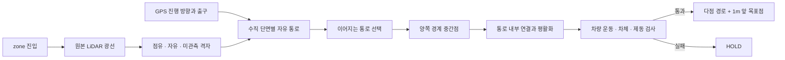

# New_Avoid_v2 — 벽 사이 중간점으로 레퍼런스 패스 생성

2026-09-15 · 브랜치 `New_Avoid_v2`.

> 이 문서는 유동 속도 도입 전의 고정 1m/s 기록이다. 현재 구현과 결과는 [유동 속도 보고서](AVOID_V2_ADAPTIVE_SPEED.md)를 참조한다.

**추월 상태·조향 구간 탐색을 벽 사이 중간점 연결 로직으로 교체했다.** 연석과 차량을 같은 점유 벽으로 처리한다. 3m·1m/s 일반 주행 시험은 이전 0/60회에서 **36/60회 완주**로 바뀌었으며 **24회 HOLD는 미해결**이다.

## 입력에서 레퍼런스 패스까지



1. **관측**: zone 진입 후 LiDAR hit를 점유 셀로, 광선이 지난 곳을 자유 셀로 기록한다. 연석·차량 ID 분류는 필요 없다. 자유 공간은 0.3초 후 만료하며 점유 기억은 두 번의 새 clear 관측 전까지 유지한다. 미관측과 지도 밖은 통과할 수 없다.
2. **단면**: GPS 진행 station을 따라 0.2m 간격으로 수직 단면을 만든다. 각 단면의 좌우 ±4m를 0.05m 간격으로 조사한다. 자유 구간에서 차폭 절반과 측방 여유를 제외해 차량 중심이 들어갈 범위를 얻는다.
3. **연결된 통로**: 이웃 단면의 가용 횡방향 구간이 겹쳐야 연결한다. 동적 계획법으로 전체 연결 비용이 작은 통로를 선택한다. 비용은 중간점의 급격한 이동, GPS로부터의 거리, 이전 관측에서 선택한 안내선과의 차이를 고려한다. 서로 다른 갈림길의 점들을 임의로 평균하지 않는다.
4. **중간점**: 선택한 단면의 양쪽 경계가 `L_i`, `R_i`라면 원래 중앙점은 `M_i = (L_i + R_i) / 2`다. 단면 방향의 중앙이며, 모든 벽에 대한 전역 유클리드 등거리선은 아니다.
5. **연결과 평활화**: 차량 앞부분이 먼저 벽에 도달하므로 앞쪽 단면의 가용 범위를 함께 고려한다. 선행 거리와 평활화 강도의 제한된 조합을 비교하며, 안내점은 선택한 가용 범위 안으로 제한한다. 경계의 중간점을 그대로 조향 명령으로 보내지 않는다.
6. **실행 가능한 경로**: 안내선을 따라가는 pure-pursuit 명령을 조향 지연이 있는 bicycle 모델에 적용한다. 매 0.05m 표본에서 차체·횡가속·조향과 측정 조향을 유지하는 제동 궤적을 검사한다. 최소 목표점 길이를 확보한 경로만 출력하며, 최종 경로에서도 제동 검사를 반복한다.
7. **출력과 완료**: 다점 레퍼런스 패스와 누적 경로 길이 1m 이상의 첫 표본을 목표점으로 출력한다. GPS는 진행 방향과 출구 확인에 사용한다. 출구선의 차량 후단 통과와 GPS 위치·방향 정렬을 3개 독립 관측에서 확인한다.

실제 점유 경계뿐 아니라 관측이 끊긴 곳과 지도 경계도 자유 통로의 끝이 될 수 있다. HTML의 경계선은 **관측 자유 공간의 한계**를 표시하며, 모든 끝점이 실제 연석 반사점이라는 의미는 아니다.

## 코드 변경

- [`core.cpp`](../src/stack_avoid_v2/src/core.cpp): 기존 GPS 차단 조건 기반 추월·GPS 복귀 분기와 조향 primitive 탐색, 이전 추월 경로 재사용을 제거했다. `wall_corridor()`와 중앙 안내선의 차량 운동 검증으로 대체했다.
- [`core.hpp`](../src/stack_avoid_v2/include/stack_avoid_v2/core.hpp): 관측 자유 셀 조회, 벽 쌍·중간점·안내선 trace, `WALL_FOLLOW=6`을 추가했다.
- 차체 검사: 3원/거리장은 빠른 안전 확인에 사용한다. 여기서 확인되지 않은 공간은 **회전된 차량 사각형과 금지 격자 셀의 SAT**로 직접 검사한다. 0.15m 기본 여유와 표본 사이 이동 여유는 유지했다. 원 근사의 과도한 보수성 때문에 좁은 통로 전체를 거부하던 조건을 개선했다.
- [`AvoidPlan.msg`](../src/fma_interfaces/msg/AvoidPlan.msg): `WALL_FOLLOW` 상수를 추가했다. 기존 필드 순서는 유지한다. `maneuver_active=false`, zone 안의 `gps_follow=false`이며 `obstacle_detected`는 GPS 부근 점유의 진단값일 뿐 시작 조건이 아니다. `expanded_nodes`는 현재 운동 표본 검사 횟수다.
- [`HTML`](avoid_v2_path_lab.html): 노란 단면 경계선, 보라색 원래 중간점/평활화 안내선, 청록색 검증 경로를 구분한다. 브라우저가 별도로 계산하지 않고 실제 C++ 출력 2,100프레임을 재생한다.

GPS/zone/pose 입력, LiDAR 빔 시각 보정, 지도 점유 기억, 기한 무효화 및 watchdog은 유지한다. `/avoid_v2/course` 경계는 현재도 필요하며, LiDAR 벽보다 바깥의 추가 통과 금지 영역으로 둘 수 있다. 전역 코스 지도를 LiDAR만으로 새로 만드는 SLAM 구현은 포함하지 않는다.

## 3m · 동일 크기 차량 시험

도로 3.0m, 자차·고정 차량 길이 0.85m × 폭 0.62m, 속도 1m/s, 10Hz를 유지했다. 이번 알고리즘 변경에 맞춰 장애물 위치나 도로 폭을 넓히지 않았다. 각 배치 3회, 총 78회다.

| 배치 | 완주 | 종료 시각 [s] | 판정 |
| --- | ---: | ---: | --- |
| S자 · 좌→우 교대 2대 | 3/3 | 14.6 | 완주 |
| S자 · 왼쪽 연속 2대 | 3/3 | 14.3 | 완주 |
| 직선 · 좌→우 교대 2대 | 3/3 | 11.8 | 완주 |
| S자 · 우→좌 교대 2대 | 3/3 | 14.8 | 완주 |
| S자 · 오른쪽 연속 2대 | 3/3 | 14.9 | 완주 |
| 직선 · 우→좌 교대 2대 | 3/3 | 11.8 | 완주 |
| S자 · 좌우 차량 / 중앙 통로 2대 | 0/3 | 3.2 | 미해결 HOLD |
| 직선 · 중심선 차량 2대 | 0/3 | 0.5 | 미해결 HOLD |
| S자 · GPS 진행 공간 밖 2대 | 3/3 | 14.5 | 완주 |
| zone 진입 후 인식 2대 | 0/3 | 4.9 | 미해결 HOLD |
| 앞 공간 미관측 2대 | 0/3 | 0.0 | 예상 HOLD |
| 관측 만료 · 점유 기억 2대 | 0/3 | 0.3 | 예상 HOLD |
| 진입 직후 근접 차량 2대 | 0/3 | 0.0 | 예상 HOLD |
| S자 · 좌→우 교대 3대 | 0/3 | 7.6 | 미해결 HOLD |
| S자 · 왼쪽 연속 3대 | 3/3 | 14.4 | 완주 |
| 직선 · 좌→우 교대 3대 | 0/3 | 7.7 | 미해결 HOLD |
| S자 · 우→좌 교대 3대 | 3/3 | 14.9 | 완주 |
| S자 · 오른쪽 연속 3대 | 3/3 | 14.8 | 완주 |
| 직선 · 우→좌 교대 3대 | 0/3 | 7.7 | 미해결 HOLD |
| S자 · 좌우 차량 / 중앙 통로 3대 | 3/3 | 14.5 | 완주 |
| 직선 · 중심선 차량 3대 | 0/3 | 0.5 | 미해결 HOLD |
| S자 · GPS 진행 공간 밖 3대 | 3/3 | 14.5 | 완주 |
| zone 진입 후 인식 3대 | 0/3 | 4.9 | 미해결 HOLD |
| 앞 공간 미관측 3대 | 0/3 | 0.0 | 예상 HOLD |
| 관측 만료 · 점유 기억 3대 | 0/3 | 0.3 | 예상 HOLD |
| 진입 직후 근접 차량 3대 | 0/3 | 0.0 | 예상 HOLD |

- 일반 주행: **36회 완주 / 24회 HOLD**.
- 미관측·관측 만료·진입 직후 근접 차량: **18회 예상 HOLD**. 추월/완주 성공으로 세지 않는다.
- 검사한 현재 차체·선택 경로·실행할 0.1m 구간에서 차량 접촉·연석 접촉 검출 **0**. **HOLD 이후 실제 제동은 실행하지 않았다.**
- 미해결 배치: S자 좌→우→좌 3대, 직선 교대 3대 양방향, S자 중앙 통로 2대, 직선 중심선 2대·3대, zone 진입 2대·3대. 기록 이유는 `wall midline has no certified forward rollout`이다. 통로 안내선은 있으나 필요한 길이의 차체·조향·제동 검증 경로를 만들지 못했다. 공간이 물리적으로 없다는 증거가 아니다.

원시 기록: [78회 결과](avoid_v2_wall_results.txt), [전체 CTest 기록](avoid_v2_wall_ctest.txt).

## 별도 검증

- **기본 코어 시험 통과**: 신선도·점유 기억·기하·중복 관측 거부·계산 기한·출구 확인.
- **LiDAR 벽 시험 418개 검사 통과**: 지도는 7m 폭이고 관측 연석은 3m 폭인 조건에서 벽 중앙을 따른다. 앞·뒤 센서 원점의 1,440개 광선을 벽·차량 선분에 교차시키며 가장 가까운 반사점까지만 free를 기록한다. 동일 크기 차량 두 대와 가려진 영역을 포함한 최초 관측에서 검증된 전진 구간을 출력한다. 이 시험은 LiDAR 폐루프 완주 시험이 아니다.
- **사각형 검사 추가 확인**: 좁은 평행 통로는 여유를 유지하며 허용하고, 차량 접촉·연석 접촉·추가 이동 여유 부족은 거부한다.
- **기존 시나리오 시험 통과**, **기존 S자 좌우 시험 통과**. 0.6m/s·넓은 도로의 과거 fixture이며 현재 3m 결과와 구분한다.
- 기존 무작위 zone 배치 시험은 **6/8 완주**, 2개 배치 HOLD로 실패한다. 3m 반복 시험의 실패를 포함해 **CTest 6개 실행 파일 중 4개 통과·2개 실패**다.
- **ROS 3개 패키지 빌드 및 smoke 시험 통과**: `WALL_FOLLOW` 상태·다점 경로·1m 목표점, zone 밖 GPS 소유권, 새 스캔 대기, 입력 오류·스캔 중단·복구, 독립 watchdog.
- **HTML Chrome 검사 통과**: 1440px·390px에서 각 625개 조작 검사. 실제 중앙점이 양쪽 경계의 평균인지, 새 상태와 출력 경로가 일치하는지도 검사한다.

반복 시험의 코어 최대 시간은 **11.794ms**였다. 코어 예산 20ms와 callback 예산 35ms를 유지한다. 전체 센서 입력→CAN 송신 50ms는 아직 계측하지 않았다. 현재는 **그림자 출력**이며 MGM/CAN 주행 명령으로 연결하지 않았다.

## 재현

```bash
cmake -S src/stack_avoid_v2 -B /tmp/fma_avoid_v2_lab_build \
  -DAVOID_V2_CORE_ONLY=ON -DCMAKE_BUILD_TYPE=Release
cmake --build /tmp/fma_avoid_v2_lab_build -j2
ctest --test-dir /tmp/fma_avoid_v2_lab_build --output-on-failure
python3 src/stack_avoid_v2/tools/build_lab.py
python3 src/stack_avoid_v2/tools/verify_lab.py
```

미해결 배치 때문에 CTest는 현재 실패 종료한다. 회귀 검사를 제거하거나 기대값을 성공으로 바꾸지 않았다. ROS 빌드/실행 명령은 [패키지 README](../src/stack_avoid_v2/README.md)에 있다. 노드를 실차 launch에 연결하는 단계는 완료되지 않았다.

- 코어 SHA-256: `272b99a0a6ab42717b3eba3caf59f268f23c70ce22cec06cff681817d14d5fbe`
- fixture SHA-256: `700ef1a4946ee27ab40cdd040548cfbf4cdab3eb2bef5b8f3b92db497bab0cf0`
- HTML 생성: `2026-09-15T14:21:09+09:00`
