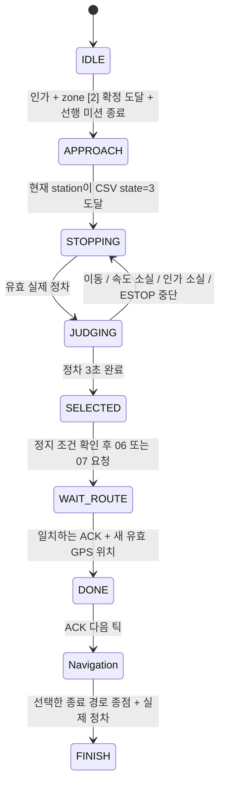

# Last_mission_state — 스테이트 v09.17

PR #113의 독립 판별 로직에 이어, 사용자 후속 지시로 MGM·YOLO·GPS·런처를
연결했다. 현재 정본은 [스테이트 v09.17](STATE_V09_17.md)이다.

## 현재 용인 동작

- 경로 05의 zone [2](idx 84~103) 진입 시 APPROACH 단계로 출구 YOLO를 켜고 계속 주행한다.
- preview가 아닌 현재 waypoint station이 CSV state=3(idx 92)에 도달하면 정차를 요청한다.
- 실제 정차 후 3초간 새 관측만 집계한다. 접근 중 검출은 정차 후 표수에 포함하지 않는다.
- `0 / red_blue_red` → Right → 경로 07.
- `1 / blue_red_red` → Left → 경로 06.
- 3초 후 무검출 또는 동률이면 경로 06을 선택한다.

## 전체 전이와 제어 권한

실행 권한은 `adas_mgm/core/last_mission_step.hpp`에 있다. IDLE 진입 조건은
분기 원본 경로, 확정 zone, 유효 위치, 주행 인가, 주차/회피/신호 비활성 및
선행 필수 미션 완료/실패 기록이다. 시작 시 zone 안이어도 정상 진입 확인 횟수를 거친다.

STOPPING부터 WAIT_ROUTE까지 MGM이 즉시 목표속도 0을 출력한다. 유효 실제
속도 절댓값 ≤0.001m/s부터 단조 시계 기준 3초를 센다. 판별은 신뢰도 0.5 이상인
프레임별 최고 신뢰도 클래스의 다수결이며, 같은 최고 신뢰도의 상반된 검출은 기권한다.
조기 확정하지 않는다. 이 집계 방식·임계값은 구현 기본값이다.

관측은 해당 요청 ID와 정차 이후 취득 시각을 가져야 한다. 중복·역순·미래 시각,
0.5초 초과 관측과 마감 이후 도착한 결과는 표에 포함하지 않는다. 영상 미수신이나
모델 로드 실패도 MGM 타이머에 영향을 주지 않으므로 3초 뒤 06을 선택한다.

운전자/CAN 정지, 주행 인가 소실, 이동, 속도 소실은 판별 창을 초기화한다.
상위 ESTOP은 마지막 미션보다 우선하며, 기존 회복 종료 후 정차부터 다시 판별한다.
판별 도중 zone을 벗어나거나 GPS가 끊겨도 정지 요구가 취소되지 않는다.
이미 선택된 경로는 인계 대기 중 유지한다. 새 세션은 마지막 미션 기억을 초기화한다.

선택 완료 시 원본 경로 종점을 추가로 기다리지 않고 선택한 CSV로 즉시 인계를 요청한다.
기존 정지 게이트·선행 미션 종료·유효 실제 정차·유효 GPS가 필요하다. GPS는
동일 sequence/instance와 새 request의 지정 index만 적용한다. MGM은 새 GPS 세대와
종료 경로 메타데이터를 확인할 때까지 정지한다. ACK 틱도 정지하고 다음 틱부터
GPS 주행 및 기존 내비게이션 전이를 재개한다. 06과 07은 각각 종료 경로이며 서로
연속 주행하지 않는다. 불일치 ACK·GPS 프로세스 재시작은 기존 route FAULT 정지를 따른다.

## 지도와 런처 설정

마지막 공통 경로(한라대 경로 05)의 zone 파일 `zones`에 `zone_type: LAST_MISSION_ZONE`을
지정하면 된다. `zone_id`와 `index_range` 또는 실제 start/end 위경도는 현장에서
확정한 값을 사용한다. 현재 저장소에는 임의 좌표나 시험용 zone을 추가하지 않았다.
zone 형식과 범위 검사는 기존 `load_zone_definitions`를 사용하며, preview만의
도달은 마지막 미션 진입으로 인정하지 않는다. wire zone ID는 기존 RoutePlan 전역
번호 매핑을 따르므로 지도 내 번호와 전송 번호가 달라질 수 있다.

한라대 선택형 manifest에서는 마지막 공통 경로에 이 zone이 있을 때 06·07을
함께 사전 로드한다. `selected_manifest`는 중간 경로에서 출발해도 분기 계약을
보존한다. 정적 manifest를 직접 제공할 때는 routes의 마지막 세 항목을 원본·06·07로
두고 `exit_branches: {source: '05', left: '06', right: '07'}`를 지정한다.
zone과 분기 계약이 불일치하면 로드를 거부한다. source는 마지막 공통 경로여야 하며,
분기 목적지에 암묵적인 직선 연결 구간을 만들지 않는다.

prepare/drive의 기존 검증 함수가 분기 여부를 확인해 출구 검출기를 자동 실행한다.
이 계약은 revised v2 코어에서만 허용한다. 출구 미션에도 신호등 카메라 프로세스를
유지하며, 출구 검출기는 `image_topic:=/perception/traffic_image_raw`로 같은 두 번째
OAK의 원본 영상을 구독한다. 신호등 판단만 구역 제한하며 카메라를 재연결하지 않는다.
영상은 촬영 시각을 ROS 시각으로 변환해 전달하고, 출구 추론은 별도 worker에서 수행한다.
MGM 명령이 0.25초 이상 끊기면 출구 추론을 중단한다.
출구 검출기를 단독 실행하며 `image_topic`을 비우는 경우에만 직접 카메라를 연다.

## 메시지·진단·로그

- `/perception/exit_detection`: ExitDetection, 취득 시각·요청 ID·클래스·신뢰도.
- `/adas/mgm_state`: last_mission_phase, 요청·zone ID, 좌·우 표수, 선택 경로, fallback,
  검출 허용 여부. 단계는 IDLE=0, STOPPING=1, JUDGING=2, SELECTED=3,
  WAIT_ROUTE=4, DONE=5, APPROACH=6이다.
- CAN 상태 0~5와 참조 소스 번호는 기존 계약을 유지한다. 마지막 미션은
  ManagerState.last_mission이라는 병렬 상태이며 CAN 번호를 새로 할당하지 않는다.
- `scripts/v2 state`, 통합 RViz 상태 표시, 전이 CSV와 core_replay CSV에 마지막 미션을 표시한다.
- CoreSnapshot/RouteFeedback/ManagerState/CoreOutput 버스가 확장돼 당시 raw dump를 **v36**으로 올렸다. CSV state=3 정차 입력은 v39에 추가됐고, 현재는 기본 비활성 한라대 정지선 시험 파라미터 반영으로 **v40**이다.
  v35 도구는 이 PC의 `build_v2/replay_archive/v35_local`에 보관했다.

## 검증

검증은 합성 zone·GNSS·차속·LiDAR 입력을 사용했다. 현재 한라대 지도는 그대로다.
실차 CAN 송신이나 실제 차량 주행 시험은 하지 않았다.

- 전체 15개 패키지 빌드, CTest 30개(마지막 미션 코어 54개 조건 확인 포함).
- Python 회귀시험: GPS 203개, 나머지 관련 모듈·런처 684개 통과, 3개 skip.
- 각 마지막 미션 ROS 덤프를 v36 코어로 두 번 재생해 결과 일치 확인. v35는 보관 도구로 재생하고 새 도구의 명시적 거부 확인.
- GPS 분기 사전 로드·방향 매핑·중복 요청·종료 분기·zone 미설정 기본 동작 단위시험.
- 기존 revised v2 및 waypoint provider ROS 회귀시험.
- last_mission_ros_smoke.py: 실제 MGM와 GPS wrapper에서 Right/Left/미판별 각각
  zone 진입→3초 정지→경로 ACK→재출발→FINISH 확인. 미판별은 실제 YOLO 모델과
  빈 영상의 ROS 입력 경로까지 실행했다. 좌·우 신호는 합성 ExitDetection 관측이다.

정적 사진 검출 정확도와 실제 차량의 정차·조향 추종은 위 소프트웨어 시험과 별개다.
모델 학습 지표는 [모델 README](../src/stack_exit_decision/models/README.md)를 따른다.

접근 단계에는 일반 내비게이션 속도를 유지한다. APPROACH부터 출구 판별 종료까지 신호등 프로세스가 OAK를 계속 소유하고 출구 검출기는 원본 영상 토픽을 사용한다. 실행 중 GPS/MGM/검출기에는 메시지 필드가 추가되었으므로 전체 런처를 다시 시작해야 한다.
