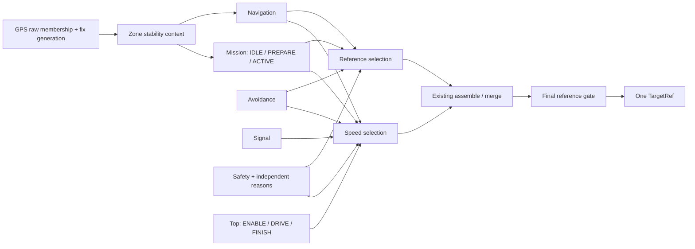

# MGM 병행 Manager / MBD 단일 명세 — 6차

> **2026-09-13 PR 검토 상태:** [현재 범위·검증 결과](INTEGRATION_V2_PR_STATUS_20260913.md). 13개 패키지 빌드 완료, Python 471 통과/3 skip.
> 전체 CTest는 11/20 통과이며 회귀 정리가 남아 있다. 아래 과거 미빌드/전체 통과 표기보다 이 결과를 우선한다.

> **2026-09-13 현재 주차 정책:** [즉시 주차 진입](MGM_PARKING_ENTRY.md)이 아래 과거 PREPARE/Zone 이탈 정책보다 우선한다.
> `parking_zone_entry_active=true`: stable Zone 진입 즉시 ACTIVE/PARKING, 준비 중 정지, 정상 종료는 done 또는 현재 CSV 종점이다.

> **2026-09-12 GPS:** 최초 최근접 index/연속 station을 저장하고 이후
> `station ± abs(TargetRef.v_ref) * GPS publish_period * 2` 안에서만 갱신한다.
> 독립 fix당 1회, 재발행/역행 표본은 재계수하지 않는다. CSV 전환/새 session에서만 초기화한다.
> 목표는 station +2.5m(종점 클램프), 한쪽 가중치 >=90%는 endpoint snap, 그 외 xy/곡률 선형 및
> yaw 최단각 보간으로 1점을 발행한다. GPS의 기존 재합류 목표 합성은 사용하지 않는다.

> **2026-09-12 카메라:** 차량 원점을 피팅 중심선에 최근접 투영한 station에서 +2.5m인
> 목표점 1개의 xy/yaw/curvature만 반환한다. 내부 다점 피팅/검사는 유지하며 동적 preview 치환은 제거한다.
> **아래 전체 provider 단일점 계약은 아직 통합 미완료다.** MGM 소스 일부는 미빌드이며,
> GPS/LINE 생산부의 1점 반환은 오프라인 검증했다. 나머지 생산부와 MGM 설치본 통합은 미완료다.

> **2026-09-12 단일 목표점:** v2 인지 제어 출력/GPS→MGM→TargetRef/CAN의 유효 점 수는 1이다.
> GPS는 n_points=1이다. LINE의 n_points는 내부 검사 표본 수이며 반환은 1점이다. CSV/Zone/계획은 유지한다.
> MGM은 단일 입력의 xy/yaw/curvature를 보존하며 1→20 원점 보간을 하지 않는다.
> 기존 소스 전환 블렌드/hold/freshness/정지 gate는 1점에 적용한다. 다점 제어 입력은 무효다.
> legacy 배열 용량 20은 역사적 generated 비교용이며 v2의 유효 입력/출력 n은 1이다.
> Recovery의 기존 직선 목표 span 1.5m를 1점으로 표현한다(Recovery OFF 유지). dump는 v18이다.

> **2026-09-12 일반 회피 OFF:** 현재 v2는 `avoidance_enabled=false`다. 아래 Avoidance 전이는
> 이 설정이 true일 때만 실행한다. false는 AVOID/CLEAR_CONFIRM/일반 Nav 부재 시 LiDAR fallback과
> 회피 전용 TTC 정지를 비활성화한다. 현재 AVOID 상태와 복귀 hold도 해제하고 Nav를 재선택한다.
> 사용할 LINE/GPS reference가 없으면 정지한다. 별도 E-stop·외부/CAN·Reference·Signal·Mission
> 정책은 유지한다. 인지 노드는 관측용으로 계속 발행한다. ROS startup-only, CoreParams int32이며 dump는 v17이다.

> **2026-09-12 속도 정책 갱신:** v2의 비정지 목표속도 크기는 `v_base`(현재 YAML 1.0m/s)로
> 고정한다. 주차와 승인된 Recovery 후진도 크기는 동일하고 부호만 음수다. provider의 0 정지 요구,
> Signal 정지 profile/일반 정지 감속, TTC/외부/CAN/Reference/종점 정지, 인계 정지는 유지한다.
> 가속 Zone·v_avoid·v_narrow·provider의 비정지 속도 크기는 사용하지 않으며 정상 주행 ramp를 우회한다.
> 아직 거리를 seed하지 않은 Signal 접근도 고정속도이며, seed 이후의 정지 profile에는 기존 merge를 적용한다.
> 아래 기존 속도 설명보다 이 갱신을 우선한다. Bus layout 변경 없이 재생 계약 버전은 v16이다.

> 2026-09-12 v2 확장: [경로 순서/전환 계약](MGM_ROUTE_SEQUENCE.md)을 함께 적용한다.
> RouteControl은 병행 제어 영역이며 한라대는 (01 또는 02)→03→04→05→(06 또는 07)이다.
> 연속 경로에서 중간 종점은 인계 정지, 마지막 CSV 본경로만 Top FINISH다.
> 시작/종료 선택을 포함한 sequence hash를 사용한다. 한라대는 직접 연결 없이 선택한 5개 CSV를 사용한다.
> 단일 CSV는 아래 6차 규칙을 유지한다. 현재 bus/raw dump는 **v15**이고 아래 v12는 6차 이력이다.

2026-09-11, `feat/state-machine`. 코드 변경 전 확정한 6차 기준이며 구현·검증 결과를 아래에 갱신한다.
이 문서가 현재 C++ `base_state_machine_enabled=true`와 향후 Stateflow 모델의 단일 기준이다.
3/4/5차 보고서는 변경 이력이다. generated v1.88과 `base_state_machine_enabled=false`는 역사적 비교 경로다.

> 2026-09-12 주차 탐색 변경: [Zone 탐색 정책](MGM_ZONE_SEARCH.md)을 적용한다.
> PREPARE의 source Zone 확정 이탈은 실패 후 현재 CSV 진행이다. 시간·거리 제한을 쓰지 않는다.

## 구현 원칙

Top/Nav/Avoid/Signal/Safety/Mission 병행 상태, Mission IDLE→PREPARE→ACTIVE,
공통 `nav_reselect()`, Reference 유효성 및 최종 gate를 유지한다. 경로 생성·인지·조향·속도 merge는 변경하지 않는다.

Zone raw membership은 현재 GNSS `reference_stamp`(실제 fix generation)에 근거한 필터를 거친다.
Zone별 raw/stable 및 연속 확인 수를 분리하고 entry/exit는 stable edge에만 생성한다.
동일 generation은 재계수하지 않고 invalid/역행 입력은 stable 문맥을 보존하며 후보 count를 초기화한다.
`zone_enter_confirm_samples`, `zone_exit_confirm_samples`는 0=미설정 계약을 유지한다.
2026-09-12 사용자 지정으로 v2 YAML/통합 launch는 **5/5**를 사용한다. 실차 검증 인증값은 아니다.
정의된 Zone이 있는데 기준이 미설정/잘못된 경우 stable 문맥을 허가하지 않고
`ZONE_CONTEXT_UNAVAILABLE` reason으로 일반 주행을 정지한다. ACTIVE Mission의 제어권은 유지한다.
유효한 빈 Zone 정의는 Normal 문맥이다. 새 session에서는 Zone 이력과 완료 기억을 초기화한다.

최근접 idx는 기존 전역 최근접 계산을 그대로 사용한다. 이전 idx·위치 변화·heading·경계까지 거리를
관측으로 추가하되 잘못된 segment가 지속되는 문제를 debounce 해결로 주장하지 않는다.
공간 hysteresis 폭/진행 연속성 gate는 실측 전 도입하지 않는다.

v2 Parking 탐색은 `parking_search_zone_only=true`로 요청의 source Zone 안에서만 준비한다.
확정 Zone 이탈은 실패 후 현재 CSV 주행이다. 시간·거리 제한은 사용하지 않아 NOT_REQUIRED=3으로 표시한다.
false인 역사적 시간/거리 모드에만 기존 CALIBRATED/UNCALIBRATED/INVALID_CONFIG와 CALIBRATION_REQUIRED 취소를 적용한다.
CSV 분석은 관측 통계만 계산하며 운영 YAML을 쓰지 않는다.

Traffic 최초 소실 edge에서 앞범퍼 기준 잔여거리 1.5m를 seed한다. 이후 실제 속도의 절댓값과
monotonic dt를 적분한다. 정지 목표는 잔여 1.0m, 관측 성공 구간은 `0 < d <= 1.0m`다.
기존 감속 profile/rate limit은 유지하므로 최종 실제 정차 위치는 별도 실차 확인 대상이다.

Recovery는 기존 escape geometry와 진입/종료 알고리즘을 유지한다. 전용 후방 corridor의
UNKNOWN/BLOCKED/CLEAR, 후방 센서 freshness를 별도 계약으로 두며 CLEAR만 승인한다.
생산자가 없는 현 상태는 UNKNOWN이다. 운영 escape_after_cycles=0을 유지한다.
횟수·실제 경과 명령 시간·실측 후진 거리를 진단하되 임의 총 반복 제한은 추가하지 않는다.

CoreSnapshot/CoreState/CoreParams/출력은 고정 배열과 POD 숫자/enum 구조체이며 ROS/STL container를 넣지 않는다.
Bus 변경에 따라 raw dump는 v12다. 구 dump는 해당 역사적 빌드로 재생한다.

## 1. Authoritative 상태와 실행 순서

| 영역 | 저장 enum / wire 값 | 역할 |
|---|---|---|
| TopState | AUTONOMOUS_ENABLE=0, AUTONOMOUS_DRIVE=1, FINISH=2 | 출발 인가와 세션 종점 |
| NavState | LINE=0, GPS_BACKUP=1, GPS_ONLY_NAV=2 | 일반 횡방향 소스 |
| AvoidState | INACTIVE=0, AVOID_ACTIVE=1, CLEAR_CONFIRM=2 | 일반 회피 소유권 |
| SignalState | SIGNAL_IDLE=0, RED_DETECTED=1, APPROACH_STOP_LINE=2, STOPPED_WAIT=3 | 신호 속도 제약 |
| SafetyState | NORMAL=0, AUTO_ESTOP=1, REVERSE_RECOVERY=2, SAFE_STOP=3 | 독립 정지/기존 Recovery |
| MissionState | MISSION_IDLE=0, MISSION_ACTIVE=1, MISSION_PREPARE=2 | 요청 준비와 실행 제어권 |

Mission의 숫자 순서와 실행 순서는 다르다. Stateflow는 IDLE→PREPARE→ACTIVE로 구성하고
기존 ACTIVE=1 wire 값을 바꾸지 않는다. MissionType은 NONE=0/T_PARKING=1/PARALLEL_PARKING=2다.

`mgm_step()` 순서: `manager_transition()` → `manager_decision()` → 유효 소스만 기존
`assemble()` → 기존 `merge()` → `final_reference_gate()`. ROS wrapper가 발행 직전 다시 검사한다.
Manager transition 내 순서: session reset → Zone → Top/Navigation → FINISH → Mission →
Avoidance → Signal → 기존 guard/Recovery/Safety. 같은 틱의 준비 완료는 그 틱의 제어권 선택에 반영된다.

Top은 go/enable이면 DRIVE, 아니면 ENABLE이다. ENABLE/FINISH에서 목표속도는 즉시 0이다.
유효 GPS 종점은 DRIVE에서 FINISH를 latch한다. **명시적 start_session만 FINISH와 완료 기억을 초기화**한다.
운전자 stop/CAN fault/센서 복구/go만으로 완료 기억이나 FINISH가 지워지지 않는다.



Top의 DRIVE guard는 Mission 시작/일반 회피/출력을 제약한다. ENABLE에서도 Zone 관측과
이미 latch된 요청의 monotonic lifetime은 계속 갱신한다. 위 병행 영역을 DRIVE 이탈 시 모두
초기화하거나 정지시키는 Stateflow 구조로 옮기지 않는다.

## 2. Navigation / NAV_RESELECT

`manager_step.cpp::nav_reselect()`는 저장 상태가 아닌 선택 함수다.

1. 보존된 stable GPS-only membership이면 GPS_ONLY_NAV.
2. 그 외 LINE_RETURN_READY이면 LINE.
3. 그 외 usable GPS이면 GPS_BACKUP.
4. 둘 다 없으면 소스를 억지 생성하지 않고 기존 Avoidance fallback / Safety arbitration에 맡긴다.

LINE_RETURN_READY = 유효 LINE reference + high count 50 + GPS-only 밖 +
(hold 없음 또는 GPS 불가). GPS 불가 예외는 남은 hold만 생략하며 50표본 MGM count를 생략하지 않는다.
LINE에서 invalid 또는 low 50이면 usable GPS로 전환한다. GPS-only에서는 LINE이 좋아도 복귀하지 않는다.
GPS-only GPS 상실은 stable 문맥 유지 + SAFE_STOP이다.

공통 재선택 호출: GPS-only exit, Mission 종료/취소, LiDAR fallback에서 Nav 복구,
CLEAR_CONFIRM 종료, Recovery 종료/경로 대기, SAFE_STOP 해제. 현재 Mission/Zone/reference의
제약을 다시 적용하므로 SAFE_STOP 해제를 LINE 전이로 모델링하지 않는다.

## 3. Avoidance와 시간 조건

일반 DRIVE, usable LiDAR, ACTIVE Mission 아님, GPS-only에서 GPS 상실 아님일 때만 실행한다.
기존 obstacle_detected && avoidable && avoid-zone 허용 또는 일반 구간의 Nav 불가 fallback이 진입 조건이다.
장애물 재관측은 ACTIVE 및 두 소실 timer 초기화. 장애물이 사라지면 CLEAR_CONFIRM이다.
Nav 소스가 복구된 LiDAR-only fallback은 장애물 episode가 없으므로 확인 timer 없이 재선택한다.

| 조건 | 카운트 기준 | 값 / 경계 |
|---|---|---|
| LINE low/high | MGM control tick | 기존 n_cycles=50. high는 confidence>=return, low는 confidence<exit |
| 장애물 소실 확인 | MGM control tick | 200. 첫 소실 표본=1, 199 유지/200 종료 |
| LINE 복귀 hold | MGM control tick | 300. 위 첫 소실 시점부터 함께 계산. GPS가 있으면 200~300 구간 GPS 우선 |
| Zone entry/exit | **독립 유효 GNSS generation** | 사용자 지정 5/5. 위 MGM timer와 절대로 합치지 않음 |

CLEAR_CONFIRM의 invalid/empty/stale 회피 ref는 소유권 유지+0 속도다. 200/300 timer는 계속 진행한다.
회피 path 생성·maneuver_done 알고리즘은 변경하지 않는다. 병행 Manager의 종료 조건을
legacy avoid_max_cycles/maneuver_done 기반 flat FSM으로 대체하지 않는다.

## 4. Signal / 앞범퍼 정지 목표

RED_DETECTED는 red_active로 진입, red_active && stopline_detected가 APPROACH_STOP_LINE을 연다.
정지 episode에서 첫 stopline true→false만 `traffic_ramp_distance_m=1.5m`로 seed한다.
seed 틱에는 적분하지 않는다. 이후:

`d[k] = d[k-1] - abs(VehicleVector.v[k]) * (monotonic_ns[k]-monotonic_ns[k-1])*1e-9`

MGM 10ms 명령 주기가 늦어져도 실제 monotonic dt를 사용한다. 관측된 실제 속도를 구간에
영차 유지한 적분 추정이며 가감속이나 입력 공백 동안의 실제 이동을 완벽하게 복원하지 않는다.
속도 freshness는 기존 0.2s다. invalid/비유한 속도 또는 역행 시계는 신호 정지 중 VEHICLE_SPEED로 정지한다.

`traffic_stop_offset_m=1.0m`는 **앞범퍼에서 정지선까지 남은 목표거리**다. 1.5m에서
0.5m 이동하면 도달한다. 기존 profile은 d>offset에서 `clamp(d/1.5,0,1)*v_base`,
d<=offset에서 0 요구이며 기존 merge rate limit을 그대로 거친다. 1m에서 명령 0을
요구한다는 것이 실제 차량이 정확히 그 지점에서 이미 정지했다는 뜻은 아니다.

remaining<=offset이고 기존 정지 속도 허용치(abs(actual_v)<=1e-3)를 만족하면 STOPPED_WAIT다.
정지 후 다시 밀리면 잔여거리도 계속 관측한다. `traffic_stop_in_success_region`은 알려진 거리,
fresh finite 실제 정지 속도, `0 < d <= 1.0`을 만족하는 **추정 위치 진단**이다.
정지선 통과는 음수 remaining으로 남기며 성공으로 기록하지 않는다.
카메라 optical-Z를 범퍼 거리로 변환하는 새 수치나 제동 보상은 넣지 않았다.
1.5m 소실 seed가 실제 장착 상태에서 범퍼 기준으로 맞는지와 최종 정차 위치는 현장 측정해야 한다.

검출 flicker와 red 소실은 seed를 초기화하거나 신호 정지를 해제하지 않는다.
**green_active && !red_active만 해제**하며 거리 기억을 초기화한다.
Signal 제약이 풀려도 외부/CAN/reference 등 다른 정지는 유지된다.

## 5. Zone Context / 안정화와 관측

GPS `ZoneMap.snapshot()`은 기존 `_in_ranges()`의 raw membership을 생산한다. wrapper는
GPS actual `reference_stamp`를 `ZoneSnapshot.generation`에 공급하고 `zone_step()`이 확정한다.
GNSS에서 위치가 동일해도 새로운 실제 fix이면 새 generation이며 timer 재발행만으로는 증가하지 않는다.

각 ID에는 raw_in_zone, stable_in_zone, enter_count, exit_count, entered/exited를 보존한다.
`in_zone`은 MGM 출력에서 stable_in_zone의 호환 별칭이다. GPS 출력의 in_zone은 raw다.
같은 generation은 count/edge를 만들지 않는다. 반대 raw 표본은 후보 연속 count를 초기화한다.
invalid/과거 generation은 stable membership을 유지하고 후보 count만 지운다.
복구 후 같은 내부 문맥은 duplicate entry 없이 유지되고, 반대 문맥은 설정된 연속 새 fix를 요구한다.
확인 값 1은 즉시 확인을 뜻하지만 **시험/사용자가 명시할 때만** 사용하며 기본으로 채택하지 않는다.

Zone ID 1..255(0=암시적 Normal), Mission ID 0..255, 고정 배열 256개.
중첩 membership은 전부 보존한다. 대표 표시만 Mission > GPS-only > Normal, 같은 우선순위 작은 ID다.
동시에 실행 가능한 Mission entry가 여러 개면 작은 Zone ID 하나를 사용하며 queue는 없다.
정의/ID/경계는 세션 중 고정이다. 설정 변경은 재시작을 요구한다. invalid snapshot은 새 metadata로
마지막 stable 소속을 바꾸지 않는다. 비활성 중 확정된 entry를 go 때 합성하지 않는다.
새 session reset 틱에는 Mission을 시작하지 않는다. reset 당시 raw 내부인 Mission Zone에는
mission_entry_suppressed를 보존하여 이후 지연 확인 entry도 실행하지 않는다. 확인된 exit/reentry 뒤에만 새 요청을 허용한다.

최근접 계산 조사:

- `PathEngine._nearest_idx()`는 전체 track에서 매번 최근접 점을 선택한다. 이전 idx/window/segment lock은 없다.
- `_target_idx()`의 전방/lookahead 검색은 **reference 목표 선택**이지 현재 위치의 segment continuity가 아니다.
- 기존 heading fusion/COG와 `PoseDeltaTracker`의 이전 pose/fix는 존재하지만 nearest 선택을 제한하지 않는다.
- 따라서 경로 알고리즘을 변경하지 않고 현재/이전 idx, ENU 위치/표본 간 변위, 실제 heading와 validity를 노출했다.
- Zone별 `boundary_distance_m`는 설정 start/end **끝점까지 유클리드 최소 거리**다. 최근접점 Voronoi 경계까지의
  정확한 signed distance나 연속 track 호길이가 아니다. 이 구분 없이 hysteresis 폭을 정하지 않는다.

`/perception/gps_path`와 `/adas/mgm_state`, 선택적 `zone_observations_csv_path`로 기록한다.
CSV는 GNSS generation당 한 번, 모든 configured Zone의 raw/stable/count/idx/좌표/heading/경계 근접도를 남긴다.
position_step은 움직이는 차에서는 실제 이동+잡음이며 GPS noise 그 자체가 아니다. 정지 구간에서 따로 통계화한다.
GPS 공백 전후 step에는 공백 중 이동이 포함될 수 있다. heading_valid=false인 접선 fallback을 진행 방향으로 신뢰하지 않는다.

공간 entry/exit hysteresis 및 segment continuity는 **CALIBRATION_REQUIRED**다. 장착 위치오차,
평행 track 간격, 교차 진행 방향, 허용 지연을 측정한 뒤 정의해야 한다. 단순 debounce로
잘못된 segment가 지속 선택되는 문제까지 해결됐다고 간주하지 않는다.

## 6. Mission Request / Calibration

현행 v2의 제어권은 Zone entry 즉시 ACTIVE다. 모듈 PREPARE/ready/ACTIVATE 절차는
ACTIVE 안에서 수행한다. 완료 또는 현재 CSV 종점에서만 정상 복귀하며 종점 미완료는
ROUTE_END=10 실패로 기록한다. Zone 이탈은 종료 조건이 아니다.
아래 PREPARE 제어권·수명 제한 설명은 `parking_zone_entry_active=false`인 과거 모드다.

유효한 stable MISSION_ZONE entry + DRIVE + 미완료·미실패 Mission ID + 현재 요청 없음 → 요청 latch → PREPARE.
request_id는 ROS event 시각과 보존된 high-water counter의 최댓값으로 만들며 session reset에도 재사용하지 않는다.
request는 Mission ID/type/source Zone, monotonic 시작/마지막 갱신 시각, elapsed, actual travel,
ack/space/ready, cancel reason과 다섯 Observation을 가진다.

PREPARE는 Navigation/Avoidance/Signal/Safety를 계속 실행한다. 이때 Mission ref 부재는 정상이다.
현재 request/mode의 fresh status, search_active, 요청 이후 실제 preparation generation, 기존 localization
readiness, 유효한 source Zone의 stable 내부 문맥, 유효 실제 속도가 모두 충족되면 ACTIVE다.
PREPARE의 확정 source Zone 이탈은 동시 ready보다 우선해 실패/CANCEL한다. GPS/Zone 불명은 정지 대기다.
해당 틱 Parking만 reference/speed를 소유하고 일반 Avoidance/AUTO_ESTOP은 마스킹한다.
Nav geometry를 비우며 ACTIVATE ack와 유효 현재 요청 Parking reference까지 0 속도로 대기한다.
모듈은 PREPARE 중 기존 detector/planner/SLAM/localization만 진행하고 maneuver tick은 ACTIVATE 이후 허가한다.

실행 active ack 이후 현재 ID/mode의 done만 완료로 인정하여 Mission ID별 기억을 쓴다.
취소/완료 뒤 공통 nav_reselect로 현재 Zone을 재평가한다. 외부 stop은 요청을 보존하며
monotonic 경과 시간과 실측 이동거리는 관측 기록만 유지한다. 시간/거리 상한은 없으며 ACTIVE는 탐색 이탈 규칙을 적용하지 않는다.

| 취소 reason | 값 | 원인 |
|---|---:|---|
| NONE | 0 | 없음 |
| SEARCH_TIMEOUT | 1 | 역사적 zone_only=false의 elapsed >= timeout |
| TRAVEL_DISTANCE | 2 | 역사적 zone_only=false의 integral(abs(actual_v)*dt) >= limit |
| EXPLICIT | 3 | operator/cancel_mission 이벤트 |
| FINISH | 4 | 상위 FINISH |
| SESSION_RESET | 5 | 명시적 새 세션 |
| CALIBRATION_REQUIRED | 6 | 역사적 zone_only=false의 UNCALIBRATED 또는 INVALID_CONFIG |
| MOTION_UNAVAILABLE | 7 | 실제 속도 freshness/finite 상실 또는 monotonic 역행 |
| MODULE_ABORT | 8 | 현재 요청 search ack 이후 모듈이 종료/취소 응답 |
| ZONE_EXIT | 9 | PREPARE의 source Zone 이탈 확정 → 실패 기억 + 현재 CSV 주행 |

취소는 완료 기억을 쓰지 않으며 다른 Mission entry를 queue하지 않는다. 이미 지나간 구간을 취소 후 자동 재생하지 않는다.

ZONE_EXIT만 Mission ID별 `mission_failed`를 기록하며 성공 `mission_completed`는 false다.
실패 ID는 같은 session에서 재진입해도 재시도하지 않는다. 명시적 새 session이 실패 기억을 지운다.
CSV의 Mission 종료 조건은 성공 또는 Zone 이탈 실패를 허용하며, 실패 순간에는 현재 CSV를 계속 주행한다.
한라대는 현재 CSV 종점+실제 정지+새 GPS 응답 이후에 다음 CSV로 이동한다.

`parking_calibration_state`: UNCALIBRATED=0 / CALIBRATED=1 / INVALID_CONFIG=2 / NOT_REQUIRED=3.
v2 zone_only=true에서는 시간·거리 제한을 사용하지 않고 NOT_REQUIRED다. 사용하지 않는 제한값의 런타임 변경은 거부한다.
false는 이전 회귀용 정책이며 두 유한 양수 조건/미설정 취소/기록 중 parameter 변경 거부를 유지한다.
`parking_search_zone_only`와 Zone 확인 수는 startup-only다. CoreParams와 Mission 실패 기억을 MBD bus에 함께 옮긴다.

분석:

```bash
python3 src/adas_mgm/tools/analyze_mission_calibration.py /path/to/mission_events.csv \
  --json /tmp/mission_calibration.json --markdown /tmp/mission_calibration.md
```

복수 CSV를 받을 수 있고 file+request ID별로 분리한다. elapsed_s(monotonic lifetime)를 사용하여
entry→search/space/ready/handoff 시간 및 ready/handoff 실제 누적 이동거리를 집계한다.
타입별 성공(done)/zone_exit_failure/역사적 timeout/distance cancel/그 외 cancel/incomplete 수와 평균/최대/p50/p90/p95/p99,
각 통계의 유효 표본 수를 제공한다. 누락 이벤트는 0으로 만들지 않는다. JSON은 모든 event의 실제 속도/ENU/idx/ID를 포함한다.
충돌하는 ID/이벤트나 잘못된 schema/음수 수치를 거부한다. 작은 성공 표본의 percentile은 운영 상한의 근거가 아니다.
출력은 항상 CALIBRATION_REQUIRED이며 YAML/운영값을 생성하지 않는다.

기존 37.92s/2.188m parallel 단일 기록은 현재 lifecycle 교정 자료로 채택하지 않았다.
Search trigger는 기존 ZoneDefinition의 index_range 또는 start/end로 별도 배치할 수 있다.
trigger→ready 이동을 측정한 뒤 위치를 결정하고 기존 range를 대체한다. 범위를 임의 확대하지 않는다.

## 7. Reference / Speed arbitration

횡방향 선택: ACTIVE Mission→Parking, 일반 Avoid ACTIVE/CLEAR→Avoidance,
그 외 Nav LINE→LINE, GPS_BACKUP/GPS_ONLY→GPS. 실제 Recovery 후진 phase는 기존 Escape reference를 사용한다.
Zone/Signal은 reference를 생성하지 않는다. STOPPED_WAIT에도 기존 선택 경로 문맥을 유지한다.

속도: 비정지 목표속도 크기는 `v_base` 하나다. LINE/GPS/AVOID/주차 전진은 +v_base,
주차/승인된 Recovery 후진은 -v_base이며 일반 주행 ramp를 거치지 않는다.
FINISH/disable/외부/SAFE_STOP/AUTO_ESTOP은 즉시 0. Parking의 0·path_blocked 요구와
TTC/wrong-way/지정 정지 guard를 유지한다. Signal은 최초 거리 seed 전에는 고정속도,
seed 후에는 기존 신호 정지 profile과 merge를 적용한다. STOPPED_WAIT는 0이다.
그 밖의 일반 정지 요구도 기존 감속 merge를 유지한다. 주차/Recovery 음수 출력이
일반 전진 소유권에 넘어가는 틱은 즉시 0이며 다음 주행 틱부터 고정속도다.

Reference available=점 존재, fresh=알려진 실제 generation의 monotonic age가 기존 timeout 이내,
valid=available+fresh+센서/모듈 사용 조건+1..20점+전 성분 finite+모든 xy가 0인 기본 버퍼 아님.
LINE confidence는 finite 0..1과 기존 low 50 gate, GPS는 유효 fix, Mission은 현재 요청 active ack/ID/mode/
요청 이후 generation을 추가로 요구한다. Recovery는 현재 phase/config/rear 인증/실제 조립 기하를 검사한다.
반복 publication은 reference_stamp 나이를 초기화하지 않는다. zero/future/regressing stamp는 승인하지 않는다.

invalid reference는 assembler에 넣지 않고 기존 유한 정지 버퍼를 유지한다. 선택 reference invalid/stale,
최종 source 불일치/기하 이상/속도 NaN 모두 최종 gate에서 **양·음 속도와 내부 ramp를 0**으로 만든다.
Mission/Avoidance가 invalid라고 제어권을 다른 provider에 넘기지 않는다. 정상 종료 전이 후 Nav 재선택은 유지한다.

## 8. SAFE_STOP SET / CLEAR — 매 틱 독립 계산

아래 mask 자체는 모두 non-latched다. CLEAR는 해당 조건이 해제되었음을 뜻하며 전체 재출발 허가는 아니다.
외부 producer/운전자/CAN latch는 입력에서 유지될 수 있다. 다른 reason, Top, AUTO_ESTOP, Signal/Mission
요구가 남아 있으면 계속 정지한다. 실제 구현: `manager_step.cpp::base_stop_reasons/manager_decision`,
`reference_safety.cpp::final_reference_gate`, `mgm_node.cpp::tick`.

| Reason / bit | SET | CLEAR | 발생 영역 | Latched / 자동 복구 | PREPARE | ACTIVE |
|---|---|---|---|---|---|---|
| GPS_ONLY_GPS_LOSS / 1 | stable GPS-only이고 GPS reference 사용 불가 | GPS usable 또는 현재 stable GPS-only 해제 또는 ACTIVE | Zone/Nav→Safety | 아니오 / 다른 조건 허용 시 | 적용 | 미적용 |
| ALL_SENSORS_LOST / 2 | camera_line_valid/gps_valid/lidar_valid 모두 false | 하나 이상 복구 또는 ACTIVE | 입력→Safety | 아니오 / 조건부 | 적용 | 미적용 |
| REFERENCE_INVALID / 4 | 선택 ref 무효·미수신·stale, 최종 source/기하 이상 또는 속도 비유한 | 현재 선택 ref와 최종 출력 모두 유효 | Ref→Safety/final gate | 아니오 / 조건부 | Nav/Avoid 검사 | Mission 검사 |
| EXTERNAL / 8 | operator stop, go 대기, CAN fault/잔존 latch 등 external_stop | 외부 입력 전부 해제, 필요한 go 재인가 | wrapper→Safety | mask 아니오; CAN 입력 latch 가능 / 조건부 | 적용 | 적용 |
| MISSION_FEEDBACK / 16 | ACTIVE이고 Parking status 미수신/timeout | fresh Parking status 또는 ACTIVE 종료 | Mission→Safety | 아니오 / 조건부 | 미적용 | 적용 |
| TRAFFIC_INPUT / 32 | TrafficStop.fail_safe_stop 또는 수신 이력 뒤 Traffic timeout | fresh fail_safe_stop=false 또는 ACTIVE | Traffic 입력→Safety | mask 아니오; producer latch 가능 / 조건부 | 적용 | 미적용 |
| VEHICLE_SPEED / 64 | Signal 접근/정지 중 actual speed invalid/nonfinite 또는 monotonic 역행 | 속도/시계 유효 또는 Signal 제약 해제 또는 ACTIVE | Signal→Safety | 아니오 / 조건부 | 적용 | 미적용 |
| REAR_UNAVAILABLE / 128 | Escape 선택 승인에서 rear bool/valid/CLEAR 중 하나라도 불충족 | Escape 선택 종료 또는 rear 인증 회복 | Recovery ref→Safety | 아니오 / 조건부 | 후진 선택 때만 | 미적용 |
| MISSION_ZONE_UNKNOWN / 1024 | zone_only PREPARE의 source Zone 문맥 불명 | source Zone 유효 또는 PREPARE 종료 | Mission/Zone→Safety | 아니오 / 조건부 | 적용 | 미적용 |
| ZONE_CONTEXT_UNAVAILABLE / 256 | Zone 정의를 관측했으나 확인 수 미설정/음수 | 유효 확인 수로 재기동/새 구성, 또는 ACTIVE | Zone→Safety | 아니오 / 조건부 | 적용 | 미적용 |

TRAFFIC_INPUT의 구체적 생산 근거: `stack_traffic/node.py` 정상 `_publish()` 호출은
`camera_fault_latched || startup_hold_latched`를 fail_safe_stop으로 전달한다.
`_publish()`의 기본 fail_safe_stop=True인 오류 출력도 포함된다. MGM wrapper는 한 번이라도
Traffic 수신 후 기존 traffic_stale_timeout_sec(0.5s)를 넘으면 이 값을 true로 보정한다.
처음부터 Traffic을 한 번도 받지 않은 구성은 timeout reason을 생성하지 않는 기존 정책이다.
red 자체는 TRAFFIC_INPUT 고장이 아니라 Signal state의 입력이다.
Mission의 fresh지만 잘못된 ID/active ack는 MISSION_FEEDBACK가 아닌 REFERENCE_INVALID에서 차단한다.
후방 상실은 보통 전이 단계에서 Recovery를 먼저 끝내므로 REAR_UNAVAILABLE bit가 항상 관측되지는 않는다.

## 9. Rear Escape Corridor evaluator — 설계 / 비활성

현재 생산자는 CLEAR를 만들지 않는다. 기존 `/perception/estop.rear_clear` bool 단독으로 base Recovery를
허용하지 않는다. 추가 계약은 rear_corridor_state UNKNOWN=0/CLEAR=1/BLOCKED=2,
rear_sensor_valid, rear_reference_stamp(실제 평가를 뒷받침한 후방 scan generation)다.
Wrapper는 기존 Estop freshness 0.25s를 typed rear generation에도 적용하며 stale/미상/잘못된 enum은 UNKNOWN이다.
일반 전진에는 rear UNKNOWN으로 정지 reason을 추가하지 않는다.

| 필요한 입력/정의 | 기존 근거 / 현재 상태 |
|---|---|
| 후방 scan | `/lidar/a2/scan`, actual stamp/valid/fresh. missing scan 또는 평가 불가능은 UNKNOWN |
| 장착 변환 | `lidar_fusion_v2/config/fixed_geometry.yaml`: a2 x=-0.110354m, y=0.002473m, yaw=93.410120deg |
| raw FOV/range | a2 20..160deg, 0.15..12m, range offset 0.069m. 차량 후방 corridor 전체 가시성은 별도 검증 |
| 차체 footprint | `stack_parking/config/parking_params.yaml`: width=0.62m, length=0.85m, front=0.760m, rear=0.090m (base_link 기준). 실제 장착/차체 일치 확인 필요 |
| 예정 후진 구간 | 기존 v_escape=-0.3m/s, escape_max_cycles=200의 명령상 0.6m. 실제 정지거리/추종 거리 보증 아님 |
| lateral safety margin / stopping margin | 전용 corridor 값 미설정. 주차 detector margin이나 도착거리로 대체 금지 |
| 최소 valid point/coverage | 주차 rear sector의 5점을 corridor 유효성 기준으로 전용하지 않음. 전체 corridor 빈 공간 증거·차폐·최소점 기준 미설정 |
| dynamic obstacle | scan 간 freshness/추적 및 후진 중 진입 장애물 처리 필요. 미확인 동적 공간은 CLEAR로 인증하지 않음 |

후방 evaluator는 차량 footprint를 예정 reverse 궤적에 따라 이동시킨 swept corridor에
측면/정지 여유를 더한 영역을 평가해야 한다. 관측 장애물이 영역을 침범하면 BLOCKED,
필수 geometry/coverage/freshness/calibration 중 하나라도 없으면 UNKNOWN, 모든 기준을 충족하고
전체 corridor가 확인될 때만 CLEAR다. max range의 빈 scan이나 먼 점 하나는 clear 증거가 아니다.
`rear_reference_stamp` 반복 재발행으로 clear 유효기간을 늘려서는 안 된다.

기존 Parking `_rear_clearance()`는 중심 -90deg, 반폭 12deg, offset 0.069m, 최소 5점,
cluster 0.04m, stale 0.35s로 **후진 도착용 벽 거리**를 계산한다. 주차 0.20m 도착 판정은
일반 Escape corridor 승인과 의미가 다르며 재사용하지 않았다. 이번 작업은 evaluator의 계약과
소비 gate/진단을 구현했으며 실제 corridor 인증 알고리즘/producer는 **FIELD_VALIDATION_REQUIRED** 상태다.

## 10. Recovery readiness / 반복 기록

기존 `update_escape()`의 armed/실제 danger 지속/양수 delay와 max/음수 속도/실행 자격/시간 상한/
후방 상실 종료를 사용한다. base에서는 require_rear_clear=false여도 typed valid CLEAR와 legacy bool veto를 요구한다.
설정이 0인 delay는 즉시 실행이 아닌 disabled다. 실차 YAML의 escape_after_cycles=0은 유지했다.

`RecoveryDiagnostics` 및 MgmState/core replay에 다음을 노출한다.

- configured: 양수 delay/max, 유한 음수 v_escape인 설정만 true.
- rear_sensor_valid, rear_corridor_state: 실제 후방 입력의 상태.
- eligible: 기존 armed/danger/delay 및 Mission/Top/Signal/강제정지/후방 조건이 모두 충족되어 후진을 허가할 수 있음.
- block_reason 값: NONE=0, CONFIG_DISABLED=1, REAR_UNKNOWN=2, REAR_BLOCKED=3, REAR_INVALID=4,
  NOT_DRIVING=5, MISSION_ACTIVE=6, FORCED_STOP=7, SIGNAL_STOP=8, NOT_ARMED=9, NO_DANGER=10, WAIT_DELAY=11.
  여러 미충족 조건 중 위 코드의 첫 차단 이유를 표시한다. 독립 SAFE_STOP mask와 다른 진단이다.
- attempt_count: 실제 phase 진입 횟수. command_time_s: 직전 최종 출력이 Escape 음수 명령이었던 monotonic 구간 합.
- measured_distance_m: 그 구간에서 관측된 `max(0,-actual_v)*dt`. 전진 움직임은 후진 거리로 세지 않는다.
  속도/시계 유효성이 빠지면 measured_distance_complete=false로 남기며 소실 구간을 임의 보간하지 않는다.
- last_reason: NONE=0, ENTERED=1, TIME_LIMIT=2, REAR_LOST=3, DANGER_CLEARED=4,
  CONFIG_DISABLED=5, AUTHORITY_LOST=6, REFERENCE_INVALID=7.

명시적 새 session에서 누적 진단을 초기화하며 ROS bag/CSV replay 기록은 이전 세션을 보존한다.
종료 뒤 기존 재무장 delay를 다시 채운다. 총 횟수/총 거리의 새 상한은 없다.
설정 OFF와 인증 생산자 부재 때문에 현재 차량 Recovery는 **사용 불가**다.

## 11. Legacy byte projection — 전체 상태가 아님

단일 정의: `manager_step.cpp::legacy_state_projection(const CoreState&)`.

| 우선순위 | 병행 상태 조건 | legacy state byte |
|---:|---|---|
| 1 | MISSION_ACTIVE | PARKING=3 |
| 2 | 실제 Escape REVERSING phase 또는 Avoid ACTIVE/CLEAR_CONFIRM | AVOID=2 |
| 3 | traffic_state_enabled && Signal APPROACH/STOPPED | TRAFFIC=4 |
| 4 | Nav LINE | LANE=0 |
| 5 | 그 외 Nav | WAYPOINT=1 |

Top/SAFE_STOP이 byte를 새 값으로 덮지 않는다. Recovery 종료 후 ref 대기만 하는 상태는
실제 후진 phase가 아니므로 현재 Avoid/Signal/Nav 규칙을 따른다. PREPARE도 일반 규칙이다.
예: GPS-only+Avoid+Signal 접근은 byte AVOID, ref Avoidance, speed Traffic이다.
PARKING byte만으로 active ack 대기/역진/안전 정지를 구별할 수 없다.
**이 byte로 flat 5-state Stateflow를 만들지 않는다.** Top/Nav/Avoid/Signal/Safety/Mission이 정본이다.
기존 generated backend v1.88은 새 병행 상태와 호환되는 모델이 아니다.

## 12. Parameters / calibration 분류

| 항목 | 현재 값/정책 | 상태 |
|---|---|---|
| lane_conf_exit/return, n_cycles | 기존 .35/.70, 50; 운용 override 유지 | IMPLEMENTED |
| clear/return hold | 200/300 MGM tick 유지 | IMPLEMENTED |
| provider freshness | YAML LINE1.0s, GPS/Avoid/Parking .5s; vehicle .2s, Estop .25s | FIELD_VALIDATION_REQUIRED (실제 지연 여유) |
| parking_search_zone_only | true; source Zone 이탈 실패 후 현재 CSV 주행 | IMPLEMENTED |
| parking_search_timeout / max_parking_search_distance | zone_only에서는 사용 안 함; 이전 회귀용 -1.0 / -1.0 | NOT_REQUIRED |
| Mission Search trigger | 기존 index_range/start/end, 임의 경계 추가 없음 | CALIBRATION_REQUIRED |
| Zone enter/exit confirm | 사용자 지정 5 / 5; 0은 미설정, 양수 정수만 유효 | FIELD_VALIDATION_REQUIRED |
| Zone spatial hysteresis / segment continuity | 관측 자료 노출, 새 폭/알고리즘 없음 | CALIBRATION_REQUIRED |
| traffic_ramp_distance_m / traffic_stop_offset_m | 사용자 지정 1.5m / 1.0m | FIELD_VALIDATION_REQUIRED (범퍼 seed/실제 정차 위치) |
| escape_after_cycles | 0 disabled 유지 | CALIBRATION_REQUIRED |
| escape v/max/rear requirement | -.3m/s / 200 cycles / true 기존값 | FIELD_VALIDATION_REQUIRED |
| rear corridor 여유·coverage·동적 장애물 | 인증값/producer 없음 | CALIBRATION_REQUIRED |
| Recovery 총 반복 상한 | 미정, 횟수/시간/거리만 기록 | CALIBRATION_REQUIRED |
| calibration CSV 도구 / raw-stable / final gate / projection | 구현 및 오프라인 시험 | IMPLEMENTED |

## 13. MBD Bus / 재생 계약

`core/manager_types.hpp`, `core/mgm_types.hpp`가 bus 필드/숫자형의 정본이다.
ZoneState(256 고정 context), MissionRequest(5 고정 Observation), ReferenceStatus(5 provider),
SafeStopReasons(uint32 bitmask), RecoveryDiagnostics를 bus/sub-bus로 1:1 옮긴다.
카운터는 int32/uint64, 시각은 int64 nanoseconds, 물리량은 선언된 float/double을 유지한다.
`stabilization_test.cpp`의 standard_layout/trivially_copyable static_assert가 Snapshot/State/Params/
Output 및 각 주요 bus를 검사한다. core에는 ROS type, std::vector/map/string, heap allocation을 추가하지 않았다.

MBD의 tunable parameter는 CoreParams다. ROS는 입력 conditioning/clock freshness/메시지 형변환을 맡고
Stateflow에 같은 유효성/monotonic/generation 입력을 공급해야 parity를 비교할 수 있다.
5차 raw v11과 6차 raw v12는 배열/필드 layout이 다르다. 이전 dump에 가짜 validity나 sample count를
붙여 재생하지 않는다. 같은 ABI와 버전의 빌드로 비교한다.

## 14. 검증 범위

6차 실행 결과/변경 파일/요구한 22항목 보고는 [MGM_STABILIZATION_REPORT.md](MGM_STABILIZATION_REPORT.md)에 기록한다.
센서·차량·CAN bridge를 실행하지 않고 격리 core/Python/ROS mock으로만 검증한다.
