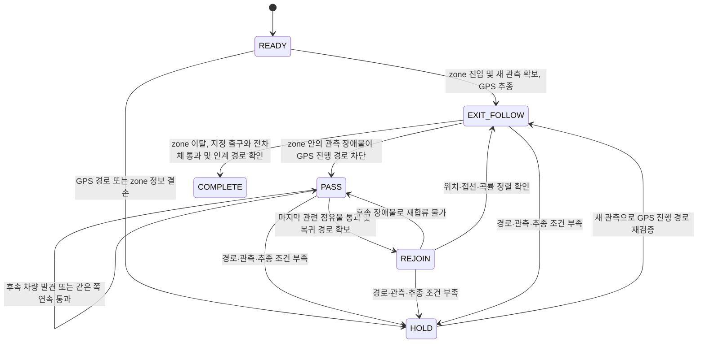

# New_Avoid_v2 — S자 코스 고정 차량 연속 회피·추월 설계

> 현재 코어는 [벽 사이 중간점 연결 설계](AVOID_V2_WALL_MIDPOINT.md)로 교체했다. 아래 추월 상태·운동 구간 탐색 설계는 과거 기록이다. 차량 제원·입력 계약·실차 연결 제약은 계속 참고한다.

작성: 2026-09-14. 상태: **설계안 / 2026-09-15 첫 구현 시작**.
독립 C++ 코어와 ROS 그림자 실행을 [stack_avoid_v2](../src/stack_avoid_v2/README.md)에 추가했다.
아래 내용은 전체 목표 설계이며, MGM·실차 적용과 50ms 엔드투엔드 검증은 아직 하지 않았다.

목표는 10Hz 장애물 인지로, 임의 위치의 고정 차량들을 접촉 없이 추월하고 S자 코스의
출구까지 주행하는 것이다. 장애물 배치가 물리적으로 통과 가능하다는 전제가 필요하다.
통로가 막힌 배치에서는 충돌 전 정지가 올바른 결과이며, 모든 무작위 배치의 탈출을 보장하지 않는다.

설계의 중심은 **S자 도로 경계 안에서 차량 운동 제약을 만족하는 경로를 탐색하고,
여러 장애물 통과·재합류·코스 출구까지 하나의 회피 세션으로 관리하는 것**이다.
경로를 못 찾거나 관측이 부족할 때의 행동도 경로 계획에 포함한다.

## 2026-09-15 변경된 실행 조건

최종 목적 경로는 GPS 노드가 발행하는 실제 다점 경로다. GPS의 유효한 `avoid_zone` 진입부터
장애물 인식을 시작하고, **GPS 진행 공간을 막는 관측된 장애물이 있을 때만 추월을 시작**한다.
zone 밖은 기존 GPS 주행이 담당하며, zone 안에서 장애물이 없으면 추월 탐색을 하지 않는다.
미관측을 장애물로 바꿔 추월을 시작하지 않는다.

통과 공간이 있는 2~3대 동시 인식 조건에서는 전체 점유물을 함께 검사하는 연속 경로를
생성한다. 첫 차량마다 복귀를 강제하지 않고, 새 관측으로 검증한 이전 경로를 이어간다.
추월 후에는 GPS 횡오차뿐 아니라 방향·곡률도 수렴시킨다. 마지막 차량이 뒤로 사라진 뒤에도
진행 중인 GPS 복귀는 끝까지 수행한다. zone 밖에서는 새 추월을 시작하지 않는다.

구현은 `stack_avoid_v2` 그림자 경로와 GPS 다점 경로 발행까지이며 MGM/CAN 연결은 아직 없다.
이 절과 아래 수정된 상태 전이가 최초 설계의 무조건적인 진입 탐색보다 우선한다.
[구현 및 검증 기록](../src/stack_avoid_v2/README.md)에 현재 입력 계약과 시험 범위를 명시했다.

## 1. 읽은 버전과 실제 주행 조건

브랜치를 이동하거나 병합하지 않고 Git에 저장된 다음 버전을 비교했다.
원격 저장소를 fetch한 결과가 아니므로 원격 서버의 최신 HEAD라고 단정하지 않는다.

| 대상 | 확인한 커밋 | 의미 |
| --- | --- | --- |
| `New_Avoid_v2`, 로컬 `integration/v2_main` | `8932df4` | 현재 작업 기준 |
| 저장된 `origin/integration/v2_main` | `39db830` | 로컬보다 6커밋 앞선 v2; GPS cubic·회피구간 진입 변경 포함 |
| 로컬 `main` | `c76f287` | 기존 gap 목표점 방식 확인 |
| 저장된 `origin/main` | `34fbfc0` | main 대비 회피 노드·판단 core 변경 없음; 해당 영역 차이는 런처·문서·시험 |

현재 파일은 상대 링크로, 앞선 원격 내용은 아래의 `git show` 명령으로 재확인할 수 있다.

```bash
git show 39db830:src/adas_mgm/core/manager_step.cpp
git show 39db830:src/adas_mgm/config/params.yaml
git show 39db830:src/fma_interfaces/msg/GpsPath.msg
git show 39db830:src/stack_avoid/stack_avoid/gps_cubic_path.py
git show c76f287:src/stack_avoid/stack_avoid/node.py
git show c76f287:src/adas_mgm/core/mgm_step.cpp
```

### 라인·GPS에서 유지할 계약

| 항목 | 코드·문서에서 확인한 조건 | 새 회피와 연결 |
| --- | --- | --- |
| 라인 출력 | 중심선 최근접 station에서 경로 길이 +2.5m의 **1점**, x/y/yaw/curvature | 일반 라인 주행 계약 유지. 목표점 하나로 도로 폭을 추정하지 않음 |
| GPS 출력 | station +2.5m의 **1점**. 끝점 가중치 90% 이상이면 snap, 아니면 보간 | 일반 GPS 계약 유지. 회피 계획에는 별도 다점 경로 창 필요 |
| GPS station | 최초 전역 탐색 후 이전 station ±(`abs(v_ref) × 0.1 × 1.5 + 0.5m`) 탐색. 같은/역행 fix는 재탐색하지 않음 | 동일 코스 ID·진행 방향 유지. S자의 옆 구간으로 최근접 점프 금지 |
| 라인 이탈 | confidence <0.35가 MGM 50틱 지속, 또는 라인 무효. 유효 GPS가 있으면 GPS_BACKUP | 평상시 정책 유지. 위험·경로 무효 정지는 이 히스테리시스를 기다리지 않음 |
| 라인 복귀 | confidence ≥0.70가 50틱, 유효 라인, GPS 전용/CSV 연결 구간 아님 | 50틱은 10ms 루프의 500ms이며 새 카메라 표본 50개를 뜻하지 않음 |
| GPS 전용 | GPS_ONLY_ZONE 및 CSV 연결 구간에서는 GPS 사용. `gps_only:=true`는 런처에서 라인 임계값을 2.0으로 올림 | 회피 중 라인 신뢰도가 올라가도 경로 소유권을 바꾸지 않음 |
| 회피 후 GPS 정렬 | 현재 station 오차 ≤0.1m, 실제 헤딩과 station 접선 오차 ≤20°, 유효한 GPS·헤딩 | 새 설계의 재합류 최소 조건으로 사용. +2.5m 목표점 yaw로 대체 금지 |
| 헤딩 | 접선 fallback은 실제 차량 헤딩이 아님; 상대 IMU yaw도 절대 ENU heading이 아님 | 회피 좌표 변환과 복귀 판정에 유효한 정렬된 헤딩 필요 |
| 신선도 | 라인 1.0s, GPS·Avoid 0.5s 설정. `reference_stamp`는 원 관측 세대 유지 | 기존 timeout은 50ms 처리 기한과 별개. 새 회피의 신선도·정지 가능 거리 계약 추가 |
| CAN | MGM 100Hz, RefPoint 1개. `0x101` 목표 뒤 `0x100` 커밋 헤더 | 내부 다점 경로와 외부 1점 제어 계약 분리 |

주의: `lane_entry_max_cross_m: 0.5`가 YAML에 남아 있지만, 읽은 병행 core의
`line_return_ready()`에는 이 횡오차 검사가 없다. 실제 회피 정렬 검사는
`gps_return_aligned()`의 0.1m/20°다. 과거 런북 설명과 실제 실행 분기를 구분한다.

속도도 버전별로 다르다. 현재 작업 기준은 일반 1.0m/s·회피 상한 0.6m/s이며,
저장된 원격 v2는 일반·회피 모두 2.0m/s다. **2.0m/s는 기존 설정이지 새 설계에서
검증된 회피 속도가 아니다.** 출발 조건 역시 현재 기준의 카메라 영상 또는 GPS FIXED에서,
원격 v2는 LiDAR 유효까지 요구하는 것으로 바뀌었다.

참조: [라인 요구사항](../src/stack_lane/REQUIREMENTS.md),
[GPS 요구사항](../src/stack_gps/REQUIREMENTS.md),
[MGM core](../src/adas_mgm/core/manager_step.cpp),
[회피 후 GPS 복귀](MGM_AVOID_GPS_RETURN.md),
[CAN 계약](../src/bridge_dspace/PROTOCOL.md).
`GPS_BOOK_FINAL.md`는 베이스 RTCM 송출 절차이며 차량 경로 생성 조건의 정본은 아니다.

## 2. 기존 실패에서 가져올 교훈

사용자 관측은 “v2 회피 실패, main은 매우 저속에서 회피했으나 두 차량 후 벽으로 진행”이다.
해당 주행의 bag·실행 파라미터·바이너리를 이번에 재생하지 않았으므로 사고 원인은 확정하지 않는다.
다음은 코드로 확인한 구조와 그 위험을 분리한 것이다.

| 확인한 구조 | S자·연속 장애물에서의 위험 | 새 설계 |
| --- | --- | --- |
| main은 차량 정면의 깊이 밴드에서 gap 목표 1개 선택 | 도로 곡률과 다음 차량을 포함한 통과 가능성을 설명하지 못함 | 코스 경계와 전체 계획 구간의 모든 점유물을 함께 검사 |
| main은 무검출 중 `(1.5, 0)` 직진점을 출력하고 무검출 시간×현재 속도에 해당하는 조건으로 완료 판단 | 기울어진 차량 헤딩을 유지하며 S자 바깥으로 이동 가능. 실제 누적 이동거리와도 다름 | 측면·후방 점유 기억, 실측 pose 진행, 도로 접선 정렬로 완료 판단 |
| 현재 로컬 station 회피는 미확인 뒤쪽에 직선 꼬리 연장 | 미관측 공간과 S자 다음 벽의 기하를 잘못 가정할 수 있음 | 관측 자유 공간 안에서 정지할 수 있는 실행 구간만 허용 |
| 원격 v2 cubic은 주 목표 하나와 고정 +2.7m 복귀 station을 유지 | 첫 차량 뒤 복귀점이 다음 차량·곡선 외벽과 충돌 가능 | 복귀 위치도 전체 탐색의 결과로 선택 |
| 이전 설계 문서는 G1→G2→B2로 기존 cubic을 확장 | 두 목표 연결만으로는 도로 경계·가림·실제 조향 오차가 해결되지 않음 | 차체·조향 응답·가시거리까지 하나의 유효성 검사에 포함 |
| main의 20분할 첫 점과 v2 단일점은 제어기에 다른 입력 기하를 전달 | 같은 장애물 목표라도 조향량이 달라짐 | dSPACE와 최종 CAN 입력까지 포함한 추종 모델 검증 |

기존 테스트 통과를 실차 성공의 증거로 사용하지 않는다. 재사용 대상은 차량 제원·좌표 보정·
메시지 형식·기록 도구 등이며, 기존 회피 목표 생성·완료 타이머·직진 유지 정책은 새 설계의 기반으로 삼지 않는다.

## 3. 10Hz와 총 지연 50ms의 시간 계약

사용자에게 측정 범위를 질의했으며, 답변 전 설계 가정은 **필수 LiDAR 스캔이 호스트에
도착한 시점부터, 그 스캔을 반영한 최종 CAN 커밋 프레임의 버스 송신 완료까지 ≤50ms**다.
콜백 실행 시작이나 planner 함수 시간만 재면 안 된다. ROS 대기열·fusion·판단·브리지 대기도 포함한다.

10Hz는 100ms마다 새 관측이라는 뜻이다. 관측 직후 발생한 변화는 다음 관측까지 거의
100ms 기다릴 수 있다. 회전식 센서의 스캔 조립·USB 전달은 별도이며, 첫 빔은 수신 시점에
이미 오래됐을 수 있다. 따라서 “현실의 변화부터 반응까지 최대 50ms”는 현재 10Hz 완성 스캔
입력만으로 보장할 수 없다. **100+50=150ms도 스캔 조립·전달을 제외한 단순 예시**다.

제안하는 엔드투엔드 예산은 다음과 같다. 모두 목표 배분이며 실측 성능 주장이 아니다.

| 단계 | 예산 |
| --- | ---: |
| 입력 전달·스케줄링·시각/좌표 정합 | 5ms |
| 점유·자유·미관측 지도와 도로 경계 갱신 | 7ms |
| 경로 후보 탐색·충돌 검사·정지 경로 검증 | 20ms |
| 독립 최종 경로 검사·출력 snapshot 교체 | 3ms |
| 다음 MGM 100Hz tick까지 대기와 판단 | 10ms |
| 브리지·CAN 버스 송신 완료 | 3ms |
| 예비 | 2ms |
| 합계 | **50ms** |

- scan callback에서 작업을 깨운다. 다시 10Hz 타이머를 기다리는 직렬 파이프라인을 만들지 않는다.
- 카메라 추론·GPS 갱신·다른 LiDAR 도착을 동기적으로 기다리지 않는다. 시각과 유효 구역을 가진
  최신 snapshot을 사용하고, 필요한 구역이 오래됐으면 속도 제한 또는 정지로 처리한다.
- 입력은 latest-only 대기열로 처리하되 누락 세대를 기록한다. 과부하로 10Hz 유효 관측을
  처리하지 못한 것을 “50ms 충족”으로 보고하지 않는다.
- 20ms 탐색 기한에는 이미 검증된 후보까지만 선택한다. 부분 계산 경로를 발행하지 않는다.
- 새 경로가 없으면 기존 경로의 남은 부분과 그 위 제동 경로를 **최신 입력으로 재검사**한다.
  유효한 경우에도 감속하며 사용하고, 근거가 없으면 MGM이 정지를 선택한다.
- planner 정체·노드 사망을 감지하는 독립 watchdog을 둔다. 같은 프로세스의 막힌 루프에
  watchdog을 넣지 않는다. CAN 단절 시에는 dSPACE 측 watchdog 동작을 별도 검증한다.
- 100Hz 제어는 같은 지도에서 pose를 보정해 실행하는 주기다. 100Hz 장애물 재관측을 뜻하지 않는다.

현재 [fusion 코드](../src/lidar_fusion_v2/lidar_fusion_v2/fusion_node.py)는 10Hz timer로
캐시를 발행하고, [설정](../src/lidar_fusion_v2/config/fixed_geometry.yaml)은 max_age=0.50s다.
합성 header는 기여 센서 중 최신 stamp이며 virtual scan의 time_increment는 0이다.
이를 그대로 소비해서 센서별 신선도나 전체 처리 지연을 인증할 수 없다.
새 회피 입력 어댑터는 원본 스캔별 stamp·원점·빔 방향·유효 FOV를 보존한다.

계측 필드: sensor/scan ID, beam 시각 범위, host ingress, map ready, plan start/end,
MGM 적용 tick, CAN TX 완료, dSPACE counter echo. 센서 시각과 monotonic clock의 대응·오차도 기록한다.
평균뿐 아니라 p95/p99/최대·deadline miss·누락 세대·최대 관측 공백을 함께 보고한다.
일반 OS에서 몇 회 50ms 이내였다는 결과만으로 최악시간 보장을 주장하지 않는다.

## 4. 코스·장애물·자차 표현

### 코스 기준과 도로 경계

GPS 원 경로를 `C(s)`로 두고, 진행거리 s와 경로 법선 방향의 횡오프셋 d를 사용한다.
좌/우 추월은 차량의 순간 y축이 아니라 **코스 진행 방향 기준**으로 정의한다.
S자의 이웃 구간으로 station이 바뀌지 않도록 경로 ID와 제한된 투영 구간을 유지한다.
심한 곡률·넓은 offset에서 좌표 변환이 퇴화하면 해당 후보를 버리고 Cartesian 기하로 검사한다.

도로는 좌우 경계가 있는 다각형으로 표현한다. GPS 중심선만으로 폭을 알 수 없다.
우선 입력은 동일 좌표계로 등록된 코스 경계이고, LiDAR 벽 관측으로 현재 장애물과 경계를 보수적으로 갱신한다.
경계 맵이 없으면 관측된 양쪽 벽/노면 경계 안에서만 실행 범위를 만든다.
일반 라인 목표점 1개는 경계 관측을 대체할 수 없다. 카메라 경계를 사용하려면 별도 경계 출력과
신뢰도·시각 계약이 필요하다. 벽이 LiDAR 스캔 높이에 잡히지 않는 구간도 별도 확인한다.

원격 v2의 `GpsPath.waypoint_points`는 station−2m~+8m 창이지만 현재 작업 기준에는 없다.
구현 시 경로 제공 계약을 명시적으로 추가하거나 동일 route provider를 연결한다.
1개의 preview 점을 늘려 원래 S자 경로를 만들어 내지 않는다.
경로 창이 부족하면 요청/확장하거나 실행 범위를 줄이며, 임의 외삽으로 출구를 만들지 않는다.

### LiDAR 지도

정적인 장애물이므로 매 프레임 독립 검출보다 pose로 정합한 국소 점유 지도에 관측을 누적한다.
셀 상태는 `occupied / observed_free / unknown`으로 나눈다.

- 실제 센서 원점에서 측정 반사점까지의 광선 구간만 자유 공간 갱신에 사용한다.
  다중 LiDAR 합성점을 차량 원점에서 raycast하면 가짜 자유 공간이 생길 수 있다.
- 반사점 뒤, FOV 밖, 센서 dropout, 의미가 불명확한 Inf/NaN은 unknown이다.
  센서별 no-return 계약이 검증된 경우에만 해당 거리까지 자유 공간으로 처리한다.
- 차량이 옆으로 빠져 전방 검출 영역에서 사라져도 점유물은 지도에 남긴다.
  일정 시간 지났다는 이유만으로 차량의 뒤쪽을 free로 바꾸지 않는다.
- 새 광선으로 실제 비어 있음이 확인된 셀만 점유를 해제한다. 오래된 free는 unknown으로 돌아간다.
- 객체 ID·코스상의 점유 station 범위·추월 쪽을 보조 상태로 유지한다.
  객체가 분리/합쳐져도 실제 점유 지도는 충돌 검사에 계속 남는다.
- 알려진 고정 차량 치수는 가려진 면의 보수적 추정에 쓸 수 있지만, 관측된 짧은 면을
  차량 전체 길이라고 간주하지 않는다. 차량과 벽의 의미 분류가 실패해도 점유물로는 회피한다.
- GPS 보정 점프·헤딩 불연속 시 지도와 차량의 관계를 재검증한다.
  매끈한 local odom 좌표와 GPS 정합을 구분하고, 틀어진 지도에서 주행을 계속하지 않는다.

### 자차와 오차

기존 설정은 폭 0.62m, 길이 0.85m, 축거 0.595m, 최소 회전반경 1.15m,
후축 원점 기준 전방 0.76m·후방 0.09m다. 이를 **설정값**으로 재사용하되 현 장착 상태와 대조한다.
기존 측방 여유 0.15m에서 직선 통과의 폭 하한은 0.92m이나, 회전·추종 오차까지 포함한 통과폭은 더 크다.

경로 점의 충돌만 검사하지 않고 시간에 따라 회전하는 차체 사각형 전체의 통과 영역을 검사한다.
기본 여유에 센서·pose·지도·제어 추종·이산화 오차 상한을 더한다.
표본 간 차체 모서리 이동을 제한하거나 보수적 swept-volume 검사로 표본 사이 충돌도 막는다.
오차 상한이 확인되지 않은 상태에서 0.15m를 충돌 방지 보장값으로 사용하지 않는다.

## 5. 경로 생성: 차량 운동을 반영한 격자 탐색

코스의 여러 station에서 횡위치·헤딩·조향 상태를 연결하는 제한된 state lattice를 사용한다.
오프라인으로 계산한 짧은 차량 운동 구간을 연결하고, 온라인에는 현재 지도에서 통과 가능성을 검사한다.
이 선택의 근거는 차량 제약을 미리 motion primitive에 포함해 온라인 탐색을 줄일 수 있다는 점이다.
이는 [CMU의 kinodynamic state-lattice 연구](https://publications.ri.cmu.edu/kinodynamic-motion-planning-with-state-lattice-motion-primitives)를
참고한 설계 선택이며, 해당 연구가 이 차량의 50ms 달성을 보장하는 것은 아니다.

기초 예측 모델은 후축 bicycle 모델에 실측 조향 응답을 추가한다.

```text
x_dot = v cos(psi),  y_dot = v sin(psi)
psi_dot = v tan(delta) / wheelbase
delta_dot = 식별된 조향 지연·속도 제한 모델
```

첫 상태는 현재 위치·헤딩·실제 속도·실제 조향으로 잡는다. 코스 중앙이나 이전 계획의 시작점에
차량이 있다고 가정하지 않는다. 명령 적용 때까지의 이동을 예측하고 그 오차도 차체 여유에 넣는다.

탐색과 선택 순서:

1. 현재 위치부터 앞으로의 도로 경계와 모든 관측 장애물을 투영한다.
2. 도로 안의 좌/우 통과 구간을 만든다. 첫 차량만 처리하지 않고 범위 안의 차량·벽을 모두 넣는다.
3. 현재 조향에서 연결 가능한 구간을 탐색한다. 다음 차량까지 같은 쪽으로 통과하는 경로,
   반대편으로 바꾸는 경로, 늦게 재합류하는 경로를 함께 비교한다.
4. 차체 충돌, 도로 이탈, 미관측 실행, 조향각·조향속도·횡가속도 초과 후보는 즉시 폐기한다.
   안전 조건을 비용 가중치로 낮춰 타협하지 않는다.
5. 남은 후보에서 최소 여유, 진행량, 제어 변화, 이전 통과 쪽 유지, 정상 경로 복귀 비용을 비교한다.
6. 선택 경로를 별도 검사기로 다시 검사하고 속도 계획과 정지 가능한 실행 구간을 확정한다.

장애물별 쪽 선택은 히스테리시스로 유지하되, 기존 쪽이 막히면 새로운 경로 전체가 검증된 경우에만 변경한다.
두 차량 사이에서 반대편으로 넘어갈 곡률·조향 전환 거리가 없으면 첫 차량 앞에서 다른 조합을 고른다.
두 번째 차량이 가려져 있으면 그 위치를 안다고 가정하지 않고, 새 시야를 얻는 동안 정지할 수 있게 진행한다.

경로 끝은 두 가지다.

- **정상 복귀 후보:** 다음 코스 구간으로 위치·접선·곡률이 연속이고, 그 이후의 제동 구간도 비어 있음.
- **부분 진행 후보:** 전체 탈출 경로를 아직 못 봤지만, 관측된 공간 안의 안전한 정지 상태까지 도달 가능.

한 차량 뒤마다 복귀를 강제하지 않는다. 복귀 station은 장애물 길이·다음 차량·S자 곡률·조향 회복 거리로 결정한다.
경로 범위는 정지 거리, 다음 회전, 후속 차량 및 복귀 구간에 필요한 길이로 정한다.
센서/지도 범위보다 필요한 길이가 길면 속도를 낮추거나 정지한다.

초기 성능 실험 후보는 0.05m 점유격자, 수 m 폭·약 8~12m 전방 지도,
station 약 0.25m / 횡방향 약 0.10m 표본이다. **운영 확정값이 아니다.**
좁은 통로에서 표본 누락이 생기면 국소 세분화하고, 탐색 노드·메모리·벽시계 기한에 상한을 둔다.
제한된 격자 탐색은 완전하지 않으므로 경로 없음은 “탐색 범위/시간 내 검증된 경로 없음”으로 기록한다.

## 6. 속도와 정지 가능한 실행 구간

충돌 거리는 차량 중심에서 정면 점까지의 거리보다, **예측 차체가 경로를 따라 처음 충돌하거나
unknown/도로 경계를 침범하기까지 이동 가능한 거리**로 구한다.

정적 장애물에 대한 보수적 1차 속도 조건은 다음과 같다.

```text
D_required = v_bound * (T_unobserved + T_delivery + 0.050 + T_brake_delay)
             + v_bound^2 / (2 * a_brake_min) + M_long
D_verified >= D_required
v_curve <= sqrt(a_lateral_max / max(abs(kappa), epsilon))
```

`v_bound`는 실측 속도의 오차를 포함한 상한이며 목표속도로 실제 속도를 대신하지 않는다.
반응 대기 중 가속할 수 있다면 위 식보다 큰 거리와 제동 시작 속도를 사용하거나 가속을 금지한다.
`T_unobserved`는 다음 관측까지의 검증된 최대 공백, `T_delivery`는 취득 후 전달 지연이다.
현재 pose로 시간 보정했다면 이미 보정한 지연을 중복 산입하지 않도록 계측 기준을 고정한다.
최종 판정은 조향을 유지/변경하며 제동하는 실제 궤적의 차체 통과 영역으로 확인한다.

단순 계산 예시: 관측 대기 0.10s, 전달 0, 처리 0.05s, 제동 응답 0.20s,
감속도 1.0m/s², 종방향 여유 0.20m를 **가정**하면 다음과 같다.

| 속도 | 요구 거리 |
| --- | ---: |
| 0.6m/s | 0.59m |
| 1.0m/s | 1.05m |
| 2.0m/s | 2.90m |

이는 속도 영향 설명용이며 현 차량 제동거리나 안전속도 인증값이 아니다.
2.0m/s에서 100ms 동안 0.20m, 50ms 동안 0.10m 이동한다.
회피를 위한 횡이동·조향 전환 거리도 별도로 필요하므로 “3.5m에서 보인다”만으로 추월 가능성을 판단하지 않는다.

기존 기록에는 0.5m/s 부근 이하의 조향 저이득 및 약 0.33s 조향 응답 사례가 있다.
따라서 “좁으면 0.2m/s로 낮춰 조향”을 기본 전략으로 삼지 않는다.
정상 접근에서 감속을 마친 뒤 **실제 추종이 검증된 속도 범위**로 회피하며,
안전 상한과 조향 가능한 속도 범위가 겹치지 않으면 정지한다.
긴급 제동은 언제든 우선한다. 이 한계가 유지된다면 하위 제어기를 먼저 수정·식별해야 한다.

## 7. 상태와 MGM 소유권

회피 내부 진행 상태와 MGM의 최종 속도·정지 권한을 분리한다. 다음 상태는 제안이며 기존 enum이 아니다.



zone 인식 세션과 실제 추월 상태를 구분한다. zone 진입 자체로 추월을 시작하지 않으며,
장애물이 없는 구간은 GPS 경로를 사용한다. 실제 추월이 시작되면 경로가 검증되고 GPS에
안정적으로 복귀할 때까지 해당 동작을 유지한다. 첫 차량 통과나 라인 confidence 회복만으로
추월을 끊지 않는다. 장애물이 없는 S코스도 EXIT_FOLLOW를 거쳐 종료한다.

MGM의 외부 정지·CAN·신호 및 다른 미션 우선순위는 일관되게 적용한다.
정지·신호 대기 동안 객체 기억과 진행 상태는 유지하고 재출발 전에 현재 pose로 재검증한다.
센서 소실·계획 실패 때 `avoid_allowed=false`만으로 일반 주행에 되돌아가는 경로를 두지 않는다.
CSV/세션 변경으로 좌표 기준이 달라지면 이전 계획을 폐기하고 새 기준 유효성 확인 전 정지한다.

S코스 프로파일에서는 기존 10초 E-stop 후 자동 후진을 해제하는 방향으로 설계한다.
후진을 도입하려면 별도의 후방 차체 경로·가시거리·실측 이동 검증이 필요하며 시간 기반 탈출을 그대로 쓰지 않는다.
이는 제안된 프로파일 변경이며 이번 문서 작성에서 설정을 바꾸지는 않았다.

### 완료·인계 조건

다음 조건을 모두 만족해야 한다.

1. 차량 **후단까지** 마지막 관련 장애물의 점유 범위를 통과했고 측면 여유가 확보됨.
2. 같은 코스 ID·순방향 station에서 횡오차 ≤0.1m, 실제 헤딩 오차 ≤20°.
3. 진입할 정상 경로의 곡률·요구 조향이 현재 상태에서 연결 가능하고 차체 통과 영역이 비어 있음.
4. 조건 1~3이 새 독립 관측에서 연속 확인됨. 초기 제안은 3세대이며 조정 가능.
5. S코스 출구 station/출구선을 전차체가 통과하고, 다음 제어원이 사용할 경로와 제동 구간도 검증됨.

0.1m/20°는 기존 복귀 기준을 계승한 상한이지 그 자체의 안전 증명은 아니다.
짧은 2.5m preview를 쓰는 제어기의 실제 포착 가능 범위에 맞춰 추가로 좁힐 수 있다.
GPS station 값이나 횡오차 하나만으로 출구를 판단하지 않고 지정 출구 기하·차체 위치와 함께 확인한다.
장애물 개수=2, 무검출 시간, 경과시간, 후속 차량 가림은 완료 조건이 아니다.

## 8. 제어기·메시지 연결에서 필요한 변경

내부에는 다점 경로, 속도 프로파일, pose 시각, 경로 ID, 지도 세대, 검증된 실행 범위,
제동 가능 거리, 최소 여유, 실패 사유를 보관한다.
외부 CAN은 기존 RefPoint 1개 형식을 유지할 수 있지만, **그 1점의 추종 결과가 내부 경로를
따르는지 반드시 검증**해야 한다. 기하 경로를 잘 그리는 것과 제어 가능한 것은 다르다.

- 일반 LINE/GPS의 +2.5m 계약은 유지한다. AVOID preview는 같은 값으로 강제하지 않고
  dSPACE 응답시험으로 결정한다. 1점으로 S자 변곡 구간 추종이 불가능하면 하위 제어 또는
  인터페이스 확장을 별도 구현 항목으로 올린다.
- yaw는 목표점 위치의 경로 접선, curvature는 같은 경로의 곡률을 사용한다.
  목표를 향한 방위각 `atan2(y,x)`로 접선 yaw를 대체하지 않는다.
- main의 목표/20 보상이 조향 저이득을 가렸다는 기록을 고려한다. 이를 그대로 복제하거나
  기하만 정상화하면 해결된다고 보지 않는다. 최종 CAN→실제 조향 관계를 식별한다.
- 계획 사이의 연속성은 현재 pose·조향에서 새 경로를 연결해 확보한다.
  MGM의 기존 10틱 점별 blend가 장애물을 가로지르지 않도록, 새 회피 인계에서는
  미검증 blend를 적용하지 않고 검증된 연결 경로를 사용한다.
- 100Hz마다 pose 보정 시 동일 delta를 중복 적분하지 않는다. vehicle frame 기준 시각을 명시하고,
  센서 generation은 원래 값을 유지한다. 좌표 갱신 시각과 관측 freshness를 별도 필드로 둔다.
- 복수 센서의 newest stamp 하나로 전체 지도의 신선도를 대표하지 않는다.
  실행에 필요한 각 영역의 관측 근거와 timestamp를 검증한다.
- 기존 `AvoidStatus`의 bool과 1점만으로 충분하지 않다. 제안 필드는 `episode_id`, `phase`,
  `route_id`, `plan_id`, `plan_valid`, `valid_until`, `certified_stop_distance`,
  `blocked_reason`과 입력 세대 정보다. 구체 타입·버전은 구현 때 확정한다.
- planner는 유효 경로·속도 상한·정지 필요 근거를 제공하고, MGM이 최종 속도와 정지를 적용한다.
  통과 경로가 없는데 `avoidable=false`만 발행하고 GPS로 계속 전진하는 동작을 금지한다.
- 독립 충돌 감시는 계획 경로뿐 아니라 **현재 실제 속도·조향에서 예상되는 차체 이동**을 검사한다.
  정면 직사각형 E-stop만으로 회전 중 외벽·측면 접촉까지 보호된다고 보지 않는다.

실행 루프의 의도는 다음과 같다.

```text
on_new_scan(scan):                         # 새 장애물 관측 10Hz
    snapshot = align_latest_inputs(scan)   # 다른 센서를 기다리지 않음
    map = update_observed_space(snapshot)
    start = predict_state_at_command_time(snapshot)
    plans = search_lattice(start, route, map, deadline=20ms)
    selected = verify_body_and_braking(select_feasible(plans))
    if selected is absent:
        selected = revalidate_previous_braking_plan(start, map)
    publish_atomic_plan_or_blocked(selected, original_input_generations)

on_control_tick():                        # MGM 100Hz
    verify_plan_deadline_pose_and_required_observation_age()
    check_actual_motion_against_obstacles_and_boundaries()
    preserve_episode_ownership_until_certified_exit()
    choose_validated_reference_and_speed_or_stop()
    transmit_single_reference_and_commit_header()
```

## 9. 구현 순서와 합격 기준

1. **좌표·하위 제어 확인:** 전/후/좌/우 표적의 실제 좌표, 4-LiDAR 장착 보정, 후축 원점,
   조향 부호·단위, 속도별 명령/실제 조향·응답시간·최소 제동 감속을 확보한다.
   장애물 없는 S자에서 정상 경로를 따라갈 수 있는 속도 범위를 먼저 확인한다.
2. **입력·지도:** 원 스캔 어댑터, 독립 센서 세대, pose 정합, 관측 자유 공간, 코스 경계와
   객체 기억을 ROS와 분리한 core로 구현한다.
3. **탐색·검사:** 제한된 lattice, 차체 swept-volume, 조향 동특성, 속도·제동 구간 검사 구현.
   최악 입력에서 20ms 탐색 예산을 측정한 뒤 지도/격자/탐색 상한을 확정한다.
4. **MGM 통합:** S코스 세션 소유권, HOLD, 안전한 인계, deadline watchdog,
   최종 CAN 점 기하와 실제 제어기 추종 검증. 단순 reference 유한값 검사만으로 완료하지 않는다.
5. **재현→닫힌루프 시뮬레이션→차량 그림자 실행→단계 주행:** 현장 실패 bag을 확보하면 우선 재생한다.
   그림자 실행은 CAN 제어권 없이 후보와 처리시간만 비교한다. 실차 속도 상한은 측정 결과로 올린다.

필수 시험 장면과 판정:

| 장면 | 합격 조건 |
| --- | --- |
| 장애물 없는 S자·출구 | 경계 침범 없이 완주, 빈 장애물 목록에서도 완료 |
| 안쪽/바깥쪽·기울어진 고정 차량 1대 | 차체 최소 여유와 조향 제한 준수, 올바른 복귀 |
| 같은 쪽 2대, 반대쪽 2대, 3대 이상 | 조기 복귀·장애물 개수 기반 종료 없음 |
| 첫 차량에 가려진 후속 차량 | 가림 속으로 정지 불가능한 속도로 진입하지 않음 |
| 마지막 차량 직후 S자 반대 굽이·출구 벽 | 헤딩 직진 유지·타이머 종료 없이 코스 따라 탈출 |
| 통과폭/조향 전환 거리 부족 | 마지막 안전 정지 영역 안에서 정지 |
| split/merge·일시 누락·측면 시야 이탈 | 점유 기억 유지, 좌우 왕복 선택·조기 완료 없음 |
| GPS jump·station 지연·헤딩 fallback·다른 CSV | 잘못된 경로 인계 없이 정지 또는 유효 범위에서만 진행 |
| 낮은 조향 이득·긴 지연·마찰 변화 | 예측 오차 검출 및 충돌 전 제동; 이상적 조향만 시험하지 않음 |
| frame 뒤집힘·센서 1개 고장·오래된 fusion | 신선한 다른 센서로 결손이 가려지지 않음 |
| 50ms 초과·프로세스 정지·CAN 두절 | 검증된 제동/독립 watchdog 작동, 낡은 주행 명령 무기한 유지 없음 |
| 회피 중 라인 confidence 회복·신호 정지/해제 | 세션 유지, 재검증 후 진행, 미검증 blend 없음 |

고정 seed 무작위 배치 시험은 통과 가능한 배치와 막힌 배치를 분리한다.
계획 알고리즘과 독립적인 충돌 검사기 및 지연·제어 오차를 포함한 차량 모델로 평가한다.
접촉·도로 침범·제약 위반은 0건이어야 하며, 통과 가능한 배치의 완주율·막힘률·불필요 정지율도 보고한다.
“모두 정지해서 충돌 0”은 완주 목표의 합격이 아니다. 유한한 시험 성공은 모든 배치의 안전 보장은 아니다.
처리 지연의 합격은 실제 대상 PC의 카메라·로깅·CAN 부하를 포함한 end-to-end 최대값과 miss 여부로 판단한다.

## 10. 수치 확정에 필요한 현장 입력

- 50ms가 호스트 수신→CAN인지, 센서 취득→CAN인지, 액추에이터 응답까지인지.
- S코스 경계·최소 폭·곡률·진입/출구 위치와 GPS 경로의 대응.
- 고정 차량의 치수·배치 가능 범위·최소 간격, 허용 추월 영역.
- 목표 주행속도와 현재 차량의 실측 조향 응답·제동 특성.
- 현재 4-LiDAR 장착/FOV·실제 인지 주기·차체 사각지대.
- 두 차량 통과 후 벽으로 진행했던 bag·실행 버전·파라미터가 있다면 그 기록.

이 정보가 없는 항목은 위 설계에서 변수·가정으로 남겼다. 첫 구현의 범위와 시험 결과는
[구현 기록](../src/stack_avoid_v2/README.md)을 따른다. 전체 설계나 50ms 엔드투엔드 지연이
이미 구현·검증되었다는 뜻은 아니다.
