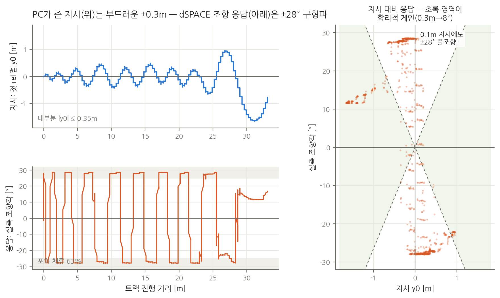
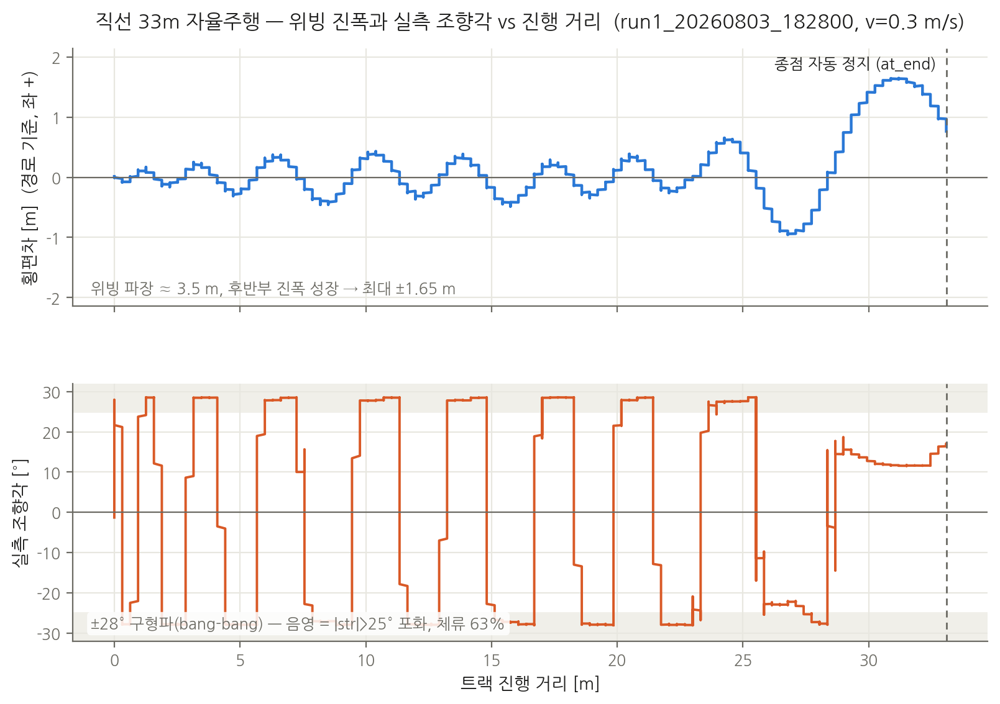

# dSPACE 조향 튜닝 요청 — GPS 주행 실측 근거 (2026-08-03, 김윤기 → 손상민)

## 원인 수렴 정리 (2026-08-04 갱신 — 합의 시험 완료 후)

위빙의 용의자를 하나씩 실측으로 배제한 결과:

| 용의자 | 배제 근거 | 판정 |
|---|---|---|
| 발행 ref 오류 | 발행 y0 ↔ 헤딩 무관 실측 횡오차 전 구간 일치 (3.02 vs 3.03m 등) | 배제 |
| 헤딩 오차 | **합의 시험(측량선 대조, 연속 회전 포함) 최대 4.3° < 기준 5° 합격** (heading_check_0804_2129). 4.3°가 만들 수 있는 건 1m당 ~7cm 쏠림뿐 — 진동 불가 | 배제 |
| RTK 좌표 밀림 | 평행이동은 방향을 못 바꿈 (기준 = 선의 방향). COG는 도플러라 RTK 미사용 | 배제 |
| 속도 과다 | 0.5→0.3m/s 감속해도 위빙 유지 (발산 거리만 8→18m) | 배제 |
| 웨이포인트 간격/품질 | 전점 FIXED 재기록 코스에서 재현 | 배제 |
| **조향 루프 (dSPACE)** | 지시 ±0.3m(부드러움)에 응답 ±28° 구형파·포화 63%. **\|y0\|<0.2m인 순간의 65%에서 풀조향.** 헤딩 검증 합격 후 재주행(8/4)에서도 동일 재현 | **잔존 유일 원인** |

왼쪽: 같은 시간축의 지시(y0)와 응답(str). 오른쪽: 지시 크기 대 조향 크기 —
합리적 게인 영역(초록, 0.3m→8°) 밖의 세로 레일(±28°)이 문제의 전부다.

## 요약

GPS 단독 주행 4회(0.5m/s 1회, 0.3m/s 3회) 결과, **PC→dSPACE로 가는 ref는 전 구간
검증 완료(정답)**이고, **종방향(v_ref 추종·정지)도 정상**. 남은 문제는 **횡방향
조향 루프의 자려진동(위빙)** 하나이며, 아래 실측 수치가 그 근거다.

검증에 쓴 데이터: `drive_logs/run1_20260803_182800/` (직선 33.4m 코스,
v=0.3m/s, RTK FIXED 전 구간, bag에 target_ref·vehicle_vector 완비).

## 실측 수치 (직선 코스 — 곡률 요인 배제된 순수 데이터)

그림이 말하는 것: **실측 조향각(0x202 str)이 ±28° 구형파(bang-bang)** — 지시
횡편차는 ±0.3m 정현파인데 조향은 레일 사이를 때리고 있다. 전형적인 릴레이형
limit cycle로, 조향 명령 포화(게인 과대) + 유효 응답 지연의 조합. 마지막 5m는
ref 점 수가 줄면서(18→2) 조향이 +12°에 고정되고 편차가 +1.65m까지 성장 —
잔여 점이 적을 때의 MPC 거동도 함께 확인 요청.

| 항목 | 값 | 의미 |
|---|---|---|
| 횡오차 | ±0.3m 진동 (최대 1.6m) | 입력(ref)은 이 작은 오차를 정확히 지시 중 |
| 실측 조향각(0x202 str) | **±28° 구형파, 포화(>25°) 체류 63%** | 0.3m 오차에 풀스케일 bang-bang = 게인 과대 |
| 위빙 주기 | ≈ 12 s (조향 반전 19회/113s) | 파장 ≈ 3.5m @ 0.3m/s |
| ref→실조향 상관 | 최대 |0.6~0.76|, 지연 수 초 | 액추에이터 지연/rate 포함 유효 응답이 매우 느림 |
| 속도 의존성 | 0.5m/s: ~8m 만에 3m 발산 / 0.3m/s: ~18m | 속도를 낮춰도 진동 유지 → 게인·지연 구조 문제 |
| 종방향 | v_ref 0.30 지시 → 실측 평균 0.30, v_ref 0 → 즉시 감속 정지 | **정상 — 손 안 대도 됨** |
| 정지 시 str | 벤치 +4.3°, 주행 전 -1.3° | 서보 센터 캘리브레이션 재확인 (사소) |

## 요청 사항 (우선순위 순)

1. **조향 서보 스텝 응답 측정 (벤치)** — str_ref 계단 입력(예: 0→15°) 시 실제
   str 도달 시간·rate limit을 측정해서 공유. 위 지연이 서보 자체인지 MPC
   출력인지 분리하는 첫 단추.
2. **MPC 예측 모델에 조향 액추에이터 지연 반영** — 현재 kinematic bicycle이
   조향을 즉시 반영한다고 가정하면, 실제 지연 수 초와 결합해 정확히 이런
   limit cycle(포화 왕복)이 나온다. 1차 지연(시정수) 또는 rate limit을 모델에.
3. **횡오차 가중치 ↓ / 조향(변화) 가중치 ↑** — 0.3m 오차에 28° 조향은 과응답.
   목표 감각: 0.3m 오차에서 조향 5~8°.
4. **0x202 str 부호 정의 재확인** — 발행 y0(좌+)와 실측 str의 상관 부호가
   음(-0.62~-0.76)으로 나옴. 주행 자체는 대체로 추종했으므로 구동은 맞고
   **보고값 부호가 PROTOCOL(좌+)과 반대일 가능성**. 확인만.
5. **vehicle vector counter 미갱신** — 0 고정으로 수신됨. 계약(0x202 커밋)상
   채우기로 했으면 반영.
6. **질문: 차량 최소 회전 반경?** — course_2의 S커브가 반경 1.4~2.6m.
   1.4m 선회가 물리적으로 불가면 코스를 재기록할 것이므로 수치 회신 요청.

## 재시험 절차 (튜닝 후)

직선 코스 `waypoints_straight_1_20260803_181924.csv`로 동일 조건 재주행 →
`lateral_*.csv`의 cross_track 진동과 bag의 str 포화 비율 비교. 합격 감각:
직선에서 횡오차 ±0.1m, 조향 포화 0%, 조향 반전 주기 불규칙(진동 아님).

## 참고 — PC 측은 검증 완료

- 발행 ref 정확성: 차가 경로 우측 3m일 때 y0=+3.02 (실측 3.03m) 등 전 구간 일치
- 헤딩: IMU(HFI-A9)+COG 융합, 부호 실측, 정지 중 유지, 오염 자가회복까지 실증
- 안전장치: 트랙 종점 정지(래치), 역방향(유턴) 자동 정지, estop 신선도 워치독
