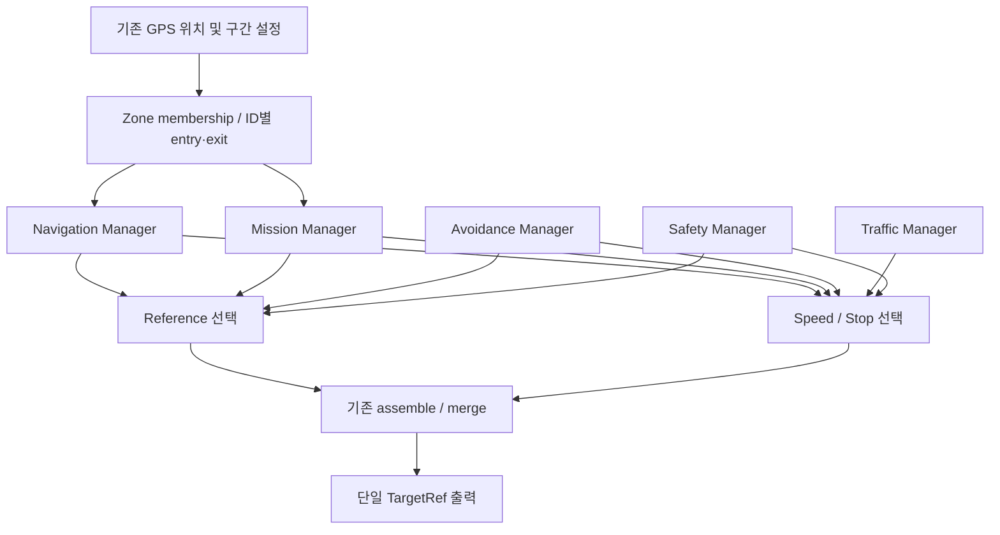

> **역사적 3차 기록 — 현재 운용/MBD 명세 아님.** 현행 기준은 [6차 단일 명세](../MGM_MBD_STATE_MACHINE_SPEC.md)다. 아래 구현/시험 결과/미해결 항목은 당시 시점의 기록이다.

# MGM 공통 자율주행 상태 머신 — 3차 Zone 통합

> **5차 적용:** Mission entry/준비/제어권 전이는 [MGM_MISSION_PREPARATION.md](../MGM_MISSION_PREPARATION.md)를 우선한다.
> Zone entry는 PREPARE 요청을 latch하고 현재 요청의 ready 이후 ACTIVE가 된다. Dump는 v11이다.

> **4차 적용:** Reference 공백의 현재 처리와 검증 결과는
> [MGM_REFERENCE_SAFETY.md](../MGM_REFERENCE_SAFETY.md)를 우선한다.
> 아래 §14–15는 수정 전 문제의 재현 기록이다. 현재는 선택 Reference가 invalid/stale이면
> SAFE_STOP_REFERENCE_INVALID로 속도를 0으로 한다. Dump는 v10으로 변경됐다.

2026-09-11, `feat/state-machine`. 이 문서는 3차 요청의 최종 구현 기준이다.
C++ `backend=core`의 병행 Manager를 유지하고 Mission 시작을 공간 Zone entry로 변경했다.
코드·모의 연결 검증을 완료했으며 실차 주행 검증은 수행하지 않았다.

## 1. 변경 요약

Navigation / Avoidance / Traffic / Safety / Mission을 병행 실행한다.
Zone은 공간 문맥만 제공하고 경로를 생성하지 않는다. 경로 선택과 속도/정지 선택을 분리하여
기존 `assemble` / `merge`에 전달하고 MGM이 10ms마다 `TargetRef` 하나를 발행한다.



기존 LINE high/low 50 cycle, 장애물 소실 확인 200 cycle, LINE 복귀 보류 300 cycle을 유지했다.
200과 300은 같은 장애물 소실 시점부터 센다. Mission/Zone/Recovery 종료가 같은
`nav_reselect()`를 사용한다. 대회별 Mission 순서를 하드코딩하지 않았다.

## 2. Waypoint Mission Trigger 제거

`MissionTrigger`, `mission_waypoint_ids`, `mission_types`, reached 입력 필드,
`/mission/waypoint_reached` 구독과 이벤트 큐를 제거했다.
Mission은 `zone_valid && in_zone && zone_entered && MISSION_ZONE`이고 지원하는 Mission Type이며
해당 Mission ID가 미완료일 때 시작한다. GPS의 목표 waypoint 갱신은 시작 조건이 아니다.

GPS Navigation의 기존 `_nearest_idx` / `_target_idx` / 경로 생성 / `at_end`는 유지한다.
실제 waypoint 도달 이벤트 생산자 연결은 이제 Mission 통합의 미완료 항목이 아니다.

## 3. Zone 판정 위치와 입력

| 단계 | 파일 / 클래스·함수 | 입력과 역할 |
|---|---|---|
| 기존 공간 판정 | `src/stack_gps/stack_gps/path_engine.py` / `PathEngine.snapshot`, `_nearest_idx`, `_in_ranges` | 실제 위치의 최근접 track idx로 구간 포함 판정. lookahead 목표 idx와 별개 |
| Zone 정의 | `src/stack_gps/stack_gps/zones.py` / `ZoneDefinition`, `ZoneMap.from_engine`, `load_zone_definitions` | 기존 GPS/주차 ranges + 선택적 `zones_file.zones` 메타데이터 |
| 전체 membership | 같은 파일 / `ZoneMap.snapshot(current_position_index)` | 기존 `_in_ranges`를 호출하여 모든 Zone의 포함/미포함 반환 |
| GPS ROS 출력 | `src/stack_gps/stack_gps/node.py` / `StackGpsNode._setup_zones`, `_fill_zone_context`, `tick` | `snap['idx']` → `/perception/gps_path`의 `GpsPath.zone_valid/zones` |
| ROS→core | `src/adas_mgm/src/mgm_node.cpp` / `toSnapshot`, `MgmNode::tick` | GPS fix/경로/기존 0.5s 신선도 + 전체 Zone snapshot |
| edge·보존 | `src/adas_mgm/core/zone_step.cpp` / `zone_step` | 유효 snapshot과 GPS usable → ID별 문맥/edge, 중첩 보존 |
| 전이·제어권 | `src/adas_mgm/core/manager_step.cpp` / `manager_transition`, `manager_decision` | Zone 문맥 → Navigation/Mission, 최종 ref 및 속도 소유권 |

기존 구간은 `gps_only_ranges`, `parking_ranges`(T), `parallel_parking_ranges`를 재사용한다.
기존 launch의 `t_parking_zone_ranges`, `parallel_parking_zone_ranges`, `zones_file` 전달도 유지한다.
위경도 경계는 기존 `PathEngine.index_of`와 `stop_zone_snap_max_m` 검증을 재사용한다.
새 polygon 판정, 거리 문턱, 위치별 transition if문은 추가하지 않았다.

## 4. Zone 데이터와 설정

- `ZoneType`: NORMAL_ZONE=0 / GPS_ONLY_ZONE=1 / MISSION_ZONE=2.
- `MissionType`: NONE=0 / T_PARKING=1 / PARALLEL_PARKING=2.
- `ZoneDefinition`: zone_id, zone_type, start_index, end_index, mission_id, mission_type.
- `ZoneObservation`: ID/타입/Mission/포함 여부. `ZoneSnapshot`: 유효성 + 전체 observation 배열.
- `ZoneContext`: zone_valid, zone_id, zone_type, mission_type, mission_id, in_zone,
  zone_entered, zone_exited. `ZoneState`: 모든 context + 대표 context + GPS-only 중첩 여부.
- Zone ID 1..255, 암시적 Normal ID 0. Mission ID 0..255는 Zone ID와 별도다.
  고정 배열 크기는 uint8 표현 용량이며 주행 임계값이 아니다.

모든 중첩 membership을 유지한다. 대표 Zone 표시만 Mission > GPS-only > Normal 순서다.
같은 우선순위는 작은 Zone ID부터 선택한다. 여러 유효 Mission이 동시에 진입하면 가장 작은
Zone ID의 실행 가능한 Mission 하나를 시작한다. 실행 중에 들어온 다른 Mission entry는 큐에
저장하거나 종료 후 level 조건으로 재실행하지 않는다.

기존 ranges에는 설정 순서대로 미사용 ID를 부여한다. 명시적 ID를 먼저 예약하며,
같은 타입/미션 타입/경계의 명시적 정의는 자동 정의를 대체한다. 여러 Zone이 같은 Mission ID와
타입을 가리킬 수 있다. 중복 Zone ID, 범위 밖 경계, 미지원 타입, 같은 Mission ID의 상충 타입은
설정 오류다. ID와 경계는 실행 중 고정이며 설정 변경 시 재시작/새 session을 사용한다.

설정 예시는 `src/stack_gps/config/mission_zones.example.yaml`에 있다. 실제 값은 `zones: []`이며
임의 활성 구간이나 실차 좌표가 없다. 확정된 기존 ranges를 사용하거나 기존 `zones_file`에
명시적 ID/타입과 측정한 `index_range` 또는 `start/end` 위경도를 설정한다.
기존 GPS-only 코스 좌표 파일은 변경하지 않았다.

## 5. Entry / Exit 생성

`zone_step()`이 ID별 이전 포함 여부를 기억하여 다음을 한 control cycle 동안만 설정한다.

- false → true: `zone_entered`.
- true → false: `zone_exited`.
- 동일 level 유지: 두 edge 모두 false.

유효한 첫 snapshot에서 내부로 관측되면 entry다. 유효한 전체 snapshot에서 빠진 Zone은
외부로 취급한다. GPS invalid/timeout 또는 잘못된 snapshot에서는 마지막 membership과
메타데이터를 유지하고 `zone_valid=false`, 두 edge=false로 한다. 복구 후 같은 Zone에 있으면
재진입 edge를 만들지 않고, 실제 외부로 확인될 때만 exit를 만든다.

Zone 관측은 autonomous disable 중에도 갱신하지만 Mission 시작은 DRIVE에서만 허용한다.
비활성 중 소비된 entry는 `/operator/go` 시 합성하지 않는다. 명시적 새 session은 완료 기억과
Zone 이력을 초기화하되 그 reset cycle에는 Mission을 시작하지 않는다. 따라서 Zone 내부에서
enable/reset한 경우 다음 실제 재진입이 필요하다. 자동 시작을 level 조건으로 바꾸지 않았다.

## 6. GPS_ONLY_ZONE

LINE/GPS_BACKUP에서 진입하면 즉시 GPS_ONLY_NAV. LINE confidence가 0.7 이상으로 50 cycle
유지되어도 Zone 안에서는 LINE으로 복귀하지 않는다. Avoidance, Traffic, Safety는 계속 동작한다.
유효 exit는 공통 `nav_reselect()`를 호출한다.

GPS-only Navigation 중 GPS가 무효하면 마지막 Zone 문맥을 유지하며 SAFE_STOP.
LINE/LiDAR로 대체하지 않는다. GPS 복구 후에도 내부면 GPS_ONLY_NAV를 유지한다.
겹친 Mission이 ACTIVE인 동안에는 아래 Mission 제어권 정책이 적용되며, Mission 종료 시
GPS-only Navigation으로 돌아갈 때 GPS가 여전히 없으면 SAFE_STOP한다.

## 7. MISSION_ZONE

유효 entry와 미완료 Mission ID로 MISSION_IDLE → MISSION_ACTIVE.
진입 cycle에 일반 Avoidance를 해제하고 해당 주차 Mission에 Reference/Speed 소유권을 준다.
일반 LINE/GPS/Avoidance 및 LiDAR AUTO_ESTOP은 Mission 출력을 덮어쓰지 않는다.
진행 중 일반 Recovery도 종료하여 Mission 제어권을 침범하지 않게 한다.

주차 모듈의 기존 `/parking/gps_command` (`String`)으로 `start perpendicular auto` 또는
`start parallel auto`를 전달한다. 구독자 연결 전에는 명령을 보류한다.
기존 `ParkingStatus.mission_active/mission_mode`의 fresh active 응답 전에는 정지 대기한다.
일반 GPS-zone 자동 시작은 통합 주차 설정에서 꺼져 있어 MGM과 중복 시작하지 않는다.

Zone exit는 Mission을 끝내지 않는다. 운전자 `/operator/stop`, 외부 정지/CAN fault,
autonomous disable, FINISH 정지는 유지한다. 주차 출력 timeout도 SAFE_STOP이다.
하드웨어 E-stop 동작 자체는 소프트웨어 Mission이 변경하지 않으며 실차 확인 대상이다.

## 8. Mission 종료 후 Zone 재평가

현재 Mission type과 일치하는 fresh active 응답을 본 뒤 같은 type의 기존 `done`을 수신하면
Mission을 종료하고 `mission_completed[active_mission_id]=true`를 기록한다.
MGM은 Mission 성공/실패 알고리즘을 추가하지 않는다. 주차 모듈의 기존 EXIT/COMPLETE 판정을 쓴다.

`nav_reselect()`의 첫 분기가 현재 GPS-only membership이다.
중첩 GPS_ONLY_ZONE이면 GPS_ONLY_NAV로 복귀하고, 그 외에는 LINE_RETURN_READY → LINE,
아니면 usable GPS → GPS_BACKUP 순서다. 사용 가능한 Navigation이 없으면 기존
LiDAR fallback / sensor fail-safe arbitration으로 처리한다. FINISH 및 명시적 session reset은
별도의 상위 중단이며 필요 시 기존 `cancel` 명령을 전달한다.

## 9. NAV_RESELECT 전체 호출 위치

정의와 모든 호출은 `src/adas_mgm/core/manager_step.cpp`에 있다.

| 호출 상황 | 역할 |
|---|---|
| 유효 GPS_ONLY_ZONE exit | 일반 구간의 Navigation 재선택 |
| 기존 Mission done | 현재 GPS-only 중첩을 먼저 확인하고 제어권 반환 |
| LiDAR-only fallback 중 Navigation 복구 | 장애물 episode를 만들지 않고 정상 Navigation 복귀 |
| CLEAR_CONFIRM 200 cycle 완료 | 남은 LINE hold를 반영하여 Navigation 선택 |
| 기존 Reverse Recovery 종료 | 현재 Zone/LINE/GPS 재평가 |
| Recovery 종료 후 실제 ref 대기 | 사용 가능한 기존 경로가 들어올 때 재평가 |
| SAFE_STOP 해제 | 회복된 센서와 현재 Zone으로 Navigation 재평가 |

`nav_reselect`는 함수이며 저장 상태가 아니다. GPS-only 문맥을 가장 먼저 처리하고,
일반 구간에서 LINE_RETURN_READY를 확인한다. 이 조건은 유효 LINE + high count 50 +
GPS-only 아님 + (LINE hold 없음 또는 GPS 불가)다. GPS 불가 예외로 생략하는 것은
남은 300-cycle hold뿐이며 high count 50은 생략하지 않는다.

## 10. Reference Arbitration

`manager_decision()` → `existing_source_request()` → 기존 `assemble()` 순서다.

| 조건 | 선택 소스 |
|---|---|
| MISSION_ACTIVE | Mission/Parking Reference |
| AVOID_ACTIVE 또는 CLEAR_CONFIRM | Avoidance Reference |
| 일반 LINE | Line Reference |
| GPS_BACKUP 또는 GPS_ONLY_NAV | GPS Reference |
| 기존 REVERSE_RECOVERY 실제 후진 phase | 기존 Escape Reference |

Zone은 Reference 소스가 아니다. Recovery는 Safety의 기존 경로 override이며 Mission 중에는
활성화하지 않는다. `reference_available`은 선택한 모듈의 경로 가용성 관측값이다.
선택 소스가 빈 경로일 때 실제 출력 기하가 무엇인지는 §14–15의 기존 hold 동작을 따른다.

통합 launch에서는 `/adas/target_ref`를 MGM만 발행한다. 별도 단위시험용 `avoid_to_ref`,
`step_injector`, parking wall-gap/parallel 시험 노드 등은 직접 발행 경로가 있으므로 통합 launch와
함께 실행하지 않는 기존 구성을 유지한다. ROS smoke에서는 MGM 송신자 1개와 시험 소비자만
존재하는지 확인한다. 저장소 전체에 다른 시험용 publisher가 없다는 뜻은 아니다.

## 11. Speed / Stop Arbitration

FINISH / autonomous disable / 외부 정지 / SAFE_STOP은 즉시 0이다. AUTO_ESTOP도 기존
emergency-stop 경로를 사용한다. 그 외 Mission은 주차 속도, 일반 Traffic 접근은 기존
stop-line 감속 profile과 선택된 주행 속도의 최소값, STOPPED_WAIT는 0, 나머지는 선택 소스의
기존 속도다. 기존 Recovery 후진 phase에서는 기존 음수 속도를 사용한다.

따라서 GPS_ONLY_NAV + AVOID_ACTIVE + APPROACH_STOP_LINE은 **회피 Reference와
신호 감속 속도**를 동시에 출력한다. green && !red만 신호 정지를 해제하며 다른 정지 사유는
그대로 유지한다. 기존 TTC/wrong-way/설정 stop-zone guard와 `merge` rate limit을 재사용한다.
Mission/Recovery의 음수 속도가 일반 전진 소유권으로 넘어가는 인계 cycle은 0으로 한다.

## 12. Mission Completed Memory와 session

`ManagerState.mission_completed[256]`을 Mission ID로 색인한다. Zone ID나 주차 타입별 bool이
아니다. 같은 Mission을 가리키는 다른 Zone에 들어가도 재실행하지 않는다. 다른 Mission ID면
같은 주차 타입이라도 별개로 실행할 수 있다. 종료 후 Zone 내부 유지/재진입 모두 중복 억제한다.

초기 `mgm_init()`과 `/operator/start_session` (`Bool=true` 이벤트)만 완료 기억을 초기화한다.
`/operator/go`, 센서 복구, 일반 estop, Zone exit 또는 임의 cycle은 초기화하지 않는다.
FINISH도 `/operator/start_session`에서만 해제한다. session 내부 Zone entry 취급은 §5와 같다.

## 13. Reverse Recovery 비활성 원인: A + B

| 구분 | 실제 근거 |
|---|---|
| **A: config OFF** | `src/adas_mgm/config/params.yaml`: `escape_after_cycles: 0`. `MgmNode` 기본값도 0이고 실차 launch가 이 설정을 전달한다 |
| **B: 필수 입력 미연결** | 같은 설정의 `escape_require_rear_clear: true`. `src/stack_estop/stack_estop/node.py::publish_current_level`이 `rear_clear`를 채우지 않아 메시지 기본 false |
| C: core 빌드 미포함 | 해당 없음. `core/mgm_step.cpp::update_escape`와 기존 `build_escape_ref`가 빌드되고 `manager_transition`의 Safety에 연결됨. 테스트에서 기존 진입 입력을 주면 실제 Escape 소스 선택 |
| legacy generated 예외 | 생성 v1.88은 새 병행 Manager/Recovery를 지원하지 않는다. 지원하지 않는 설정으로 기동하면 기존 검증이 거부한다 |

설정의 기존 `v_escape=-0.3m/s`, `escape_max_cycles=200`을 유지한다. 주석의 1000 cycle=10s는
활성화 예시이며 현재값이 아니다. 필요한 입력/조건은 양수 delay/max, 음수 후진속도,
이전 전진 명령에 의한 drive armed, fresh 실제 LiDAR estop 지속, rear_clear, DRIVE,
Mission/외부정지/신호정지/센서정지 등과 충돌하지 않는 실행 자격이다.

기존 시간 상한/후방 막힘/실제 estop 해제/기능 또는 실행 자격 해제로 후진이 종료되면
공통 Navigation 재선택을 한다. 임의 설정 활성화나 새로운 후진 알고리즘은 추가하지 않았다.

## 14. CASE A — CLEAR_CONFIRM 중 빈 Reference

`stack_avoid/stack_avoid/node.py::on_scan`은 기동 무장 중 장애물 소실 시 기존 `(1.5, 0)` 점을
발행한다. 자체 clearance가 끝난 뒤에는 빈 경로가 올 수 있다. MGM의 200-cycle 확인과
회피 노드 자체 기동 완료는 서로 다른 관측/주기이므로 빈 경로도 직접 시험했다.

`mgm_step.cpp::assemble`은 선택 경로의 `n<=0`이면 즉시 return한다. **직전 조립 출력 전체와
점 개수를 그대로 유지**한다. 잔여점을 전진시키거나 실측속도로 점을 줄이지 않고 새 기하도
만들지 않는다. `manager_decision`은 계속 Avoidance 소스와 기존 회피 속도를 요청하며,
독립적인 정지 사유가 없으면 양의 속도가 나갈 수 있다. `reference_available=false`는
진단이며 새 정지 규칙으로 연결하지 않았다.

MGM은 마지막 ref를 담은 TargetRef를 계속 발행한다. `CanBridgeNode::sendFrames`는
비어 있지 않은 점을 보내고 header counter를 증가시킨다. 현재 CAN v5는 첫 점을 보낸다.
`src/bridge_dspace/PROTOCOL.md`의 30ms watchdog 규약은 **header counter 미갱신**을 보므로
이처럼 counter가 증가하는 오래된 기하를 검출하지 못한다. 따라서 watchdog이 알아서
정지한다고 보고할 수 없다. 실제 dSPACE 조향/추종 결과는 이번 시험 범위 밖이다.

## 15. CASE B — LINE/GPS 없음 + LiDAR 유효 + 빈 경로

기존 LiDAR-only fallback이 AVOID_ACTIVE와 기존 회피 속도를 요청한다. 하지만 장애물이
없고 회피 모듈이 경로를 주지 않으면 §14와 같은 hold가 적용된다.

- 이전 주행 출력이 있으면 그 Navigation 기하가 그대로 남는다. 표시 source는 Avoidance다.
- 첫 기동부터 경로가 없으면 `mgm_init`의 점 1개 `(0,0)` 초기값이 남는다. 다른 정지 사유가
  없으면 속도는 양수로 증가할 수 있다.

이를 **통합 제한사항**으로 남겼다. 빈 입력에서 사용할 정상적인 저속 주행 경로는 현재 정의되어
있지 않다. 새 직진 목표점이나 새 정지 조건을 만들지 않았으며 실차 주행 가능으로 판정하지 않는다.

## 16. 테스트 구성

기존 30개 상황을 다루는 `manager_state_test.cpp`의 78개 검사를 유지하고 Mission 입력만
Zone 기반으로 바꿨다. 공통 setup은 `manager_test_fixture.hpp`로 추출했다.
`zone_manager_test.cpp`는 3차 요구 25개 상황과 추가 경계 조건을 49개 검사로 검증한다.

| 요구 테스트 | 검증 내용 | 위치 |
|---|---|---|
| 기존 1–5 | confidence 경계, 49/50 cycle, counter reset, camera timeout | `manager_state_test::navigation` |
| 기존 6–9 | GPS Zone 진입/탈출/loss, 내부 목표 waypoint 변경의 독립성 | `navigation` |
| 기존 10–13 | 회피 진입, 199/200, 299/300, 재검출과 timer 동시 시작 | `avoidance` |
| 기존 14–20 | 신호/정지선, 소실 edge 1회 seed, 실측속도 적분, green-only, 동시 회피 | `signal` |
| 기존 21–24 | Mission 진입(Zone으로 수정), 주차 타입, 독점권, 완료 기억 | `mission` |
| 기존 25–30 | AUTO_ESTOP, 기존 Recovery, sensor fail-safe, FINISH, 단일 출력 | `safety` 및 ROS smoke |
| 3차 1–8 | 두 Nav에서 GPS Zone 진입, 유지, exit와 LINE/GPS 선택, GPS loss·문맥 보존 | `zone_manager_test::navigation_zones` |
| 3차 9–20 | Mission edge, 중복 억제, done, overlap 재선택, exit 지속, Avoid/auto-estop 차단 | `missions` |
| 3차 21–24 | GPS-only+Avoid+Traffic, CLEAR_CONFIRM 빈 ref, LiDAR-only 빈 ref의 실제 출력 | `authority_and_gaps` |
| 3차 25 | config OFF, rear_clear 누락, 기존 Recovery 연결 | `recovery` 및 설정/생산부 추적 |
| 추가 | 중복 Zone ID, GPS 복구 시 edge 없음, Mission ID 독립/공유, session reset, Recovery→Mission | 같은 Zone 테스트 |
| Python Zone 17개 | 기존 range 재사용, 포함 경계, lookahead 독립, overlap, YAML·ID 검증, 빈 설정 | `stack_gps/test/test_zones.py` |
| ROS | 실제 GPS Zone 생산 함수→GpsPath→core→단일 TargetRef, timeout, 주차 명령/응답, 중첩 복귀 | `manager_ros_smoke.py` |

Sensor fail-safe도 기존 시험에서 유지한다: LINE 불가+GPS 가능→GPS_BACKUP,
GPS 불가+LINE_RETURN_READY→LINE, 둘 불가+LiDAR 가능→기존 회피 요청,
LiDAR 불가+Navigation 가능→Navigation 유지, 모두 불가→SAFE_STOP,
GPS-only Navigation의 GPS loss→SAFE_STOP. 빈 회피 요청의 제한은 §15와 분리한다.

## 17. 시험 결과와 재현

- 영향 패키지 **6개 빌드 성공**: fma_interfaces, adas_mgm, stack_gps, stack_avoid,
  stack_estop, stack_parking. core 및 opt-in generated backend 회귀 빌드 포함.
- CTest **12/12 통과**. 기존 Manager **78 checks**, Zone Manager **49 checks**, 실패 0.
- GPS/긴급제동/주차 Python 전체 **141/141 통과**. Zone+PathEngine 부분 집합은 45개다.
- ROS 모의 연결 **19단계 및 단일 송신자/중복 Mission 억제 검사 통과**.
- `git diff --check` 통과. 실제 차량, CAN bridge, 하위제어기는 실행하지 않았다.

빌드/설치 결과는 `/tmp/mgm-zone-build`, `/tmp/mgm-zone-install`에 분리했다.
기존 운용 install을 덮어쓰지 않았다. 재현 명령은 저장소 루트에서 다음과 같다.

```bash
source /opt/ros/humble/setup.bash
colcon --log-base /tmp/mgm-zone-build-log build \
  --base-paths src/fma_interfaces src/adas_mgm src/stack_gps src/stack_avoid src/stack_estop src/stack_parking \
  --build-base /tmp/mgm-zone-build --install-base /tmp/mgm-zone-install \
  --packages-select fma_interfaces adas_mgm stack_gps stack_avoid stack_estop stack_parking \
  --allow-overriding fma_interfaces \
  --cmake-args -DBUILD_TESTING=ON -DADAS_MGM_ENABLE_GENERATED_BACKEND=ON
ctest --test-dir /tmp/mgm-zone-build/adas_mgm --output-on-failure
source /tmp/mgm-zone-install/setup.bash
python3 -m pytest src/stack_gps/test src/stack_estop/test src/stack_parking/test -q
ROS_DOMAIN_ID=171 ROS_LOCALHOST_ONLY=1 python3 src/adas_mgm/test/manager_ros_smoke.py /tmp/mgm-zone-install/adas_mgm/lib/adas_mgm/mgm_node
```

ROS smoke는 합성 GPS 위치/기존 PathEngine과 실제 `_fill_zone_context` 함수를 사용하며,
나머지 인지/주차 응답/CAN-health는 모의 입력이다. 실제 주차 알고리즘의 현장 수행까지
입증하는 시험은 아니다. Python 시험은 sourced 구버전 GPS 패키지보다 현재 checkout을
우선 로드하도록 `stack_gps/test/conftest.py`에 경로를 지정했다.

## 18. 이번 3차 변경 파일

아래는 앞선 작업/사용자 변경과 구분한 이번 수정 범위다.

| 영역 | 파일 (저장소 루트 기준) |
|---|---|
| 명세 | `CLAUDE.md`, `docs/MGM_BASE_STATE_MACHINE.md`, `docs/MBD_KIT.md`, `src/adas_mgm/README.md` |
| Zone·Manager core | `src/adas_mgm/core/manager_types.hpp`, `manager_step.cpp`, `mgm_types.hpp`, 새 `zone_step.hpp/.cpp` |
| MGM 연결·빌드 | `src/adas_mgm/src/mgm_node.cpp`, `config/params.yaml`, `CMakeLists.txt`, `tools/dump_format.hpp` |
| ROS 메시지 | `src/fma_interfaces/CMakeLists.txt`, `msg/GpsPath.msg`, `msg/MgmState.msg`, 새 `msg/ZoneContext.msg` |
| GPS 생산부·설정 | `src/stack_gps/stack_gps/node.py`, 새 `zones.py`, `setup.py`, 새 `config/mission_zones.example.yaml` |
| core·ROS 테스트 | `src/adas_mgm/test/manager_state_test.cpp`, `manager_ros_smoke.py`, 새 `manager_test_fixture.hpp`, `zone_manager_test.cpp` |
| GPS 테스트 | 새 `src/stack_gps/test/test_zones.py`, `conftest.py` |

raw snapshot dump는 **v9**다. 이전 버전 덤프는 해당 버전 빌드로 재생해야 한다.
ROS 인터페이스 변경을 반영하려면 관련 패키지를 함께 빌드/source해야 한다.
현재 사용자 작업은 보존했고 commit/push는 하지 않았다. 이번 수정 전 백업은
`/tmp/mgm-before-zone-revision/`, 최초 재구성 전 tracked diff는
`/tmp/mgm-before-state-machine/local-changes.patch`에 있다.

## 19. 기존 알고리즘 변경 여부

이번 3차에서는 LINE/GPS 경로·Waypoint 진행·Avoidance 경로·Parking 경로·Signal 인식·
E-stop 판정·Recovery 진입/기하·조향/종방향 제어 알고리즘을 변경하지 않았다.
`core/mgm_step.cpp`는 3차 시작 전 백업과 동일하다. 생성 ADAS_MGR2 C 코드도 수정하지 않았다.

변경한 것은 Zone 메타데이터/entry 이력, Mission 시작·완료 후 제어권, Mission과
GPS-only/Recovery의 동시 상태 처리, ROS 관측 연결이다. 기존 공간 구간 판정 함수를
재사용한다. 앞선 재구성에서 추가한 유효성/상태 노출과 소유권 인계 규칙은 유지했다.

## 20. 남은 현장 확인

- 측정한 Mission Zone 경계/ID/type 설정, 실제 위치의 진입·탈출과 중첩 확인.
  최근접 track idx를 재사용하므로 교차/평행 구간, 경계 GPS 흔들림도 현장 확인이 필요하다.
- 실제 주차 모듈 시작/active/done, 일반 회피 중 Mission 인계, 종료 시 현재 Zone 복귀.
- GPS-only loss/recovery, 외부 disable·운전자/하드웨어 E-stop, 실제 CAN watchdog.
- 기존 정지선 소실 거리 seed/차량 속도 적분과 앞범퍼 실제 정지 위치, 인계 시 추종.
- §14–15의 마지막/초기 Reference와 양의 속도 조합에 대한 하위제어 처리 정의.
  현재 통신 counter watchdog으로 해결되었다고 볼 수 없다.
- Recovery를 사용하려면 실제 후방 여유 입력 연결·검증과 운용 설정 결정이 필요하다.
  현재는 OFF를 유지했다. 새 병행 Manager/Zone의 Stateflow 모델 이식과 모델 비교는 별도다.
