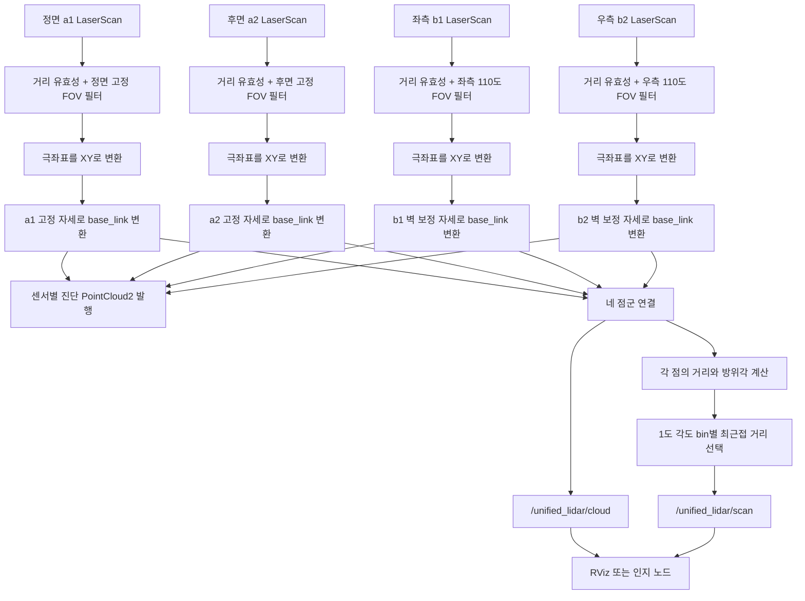
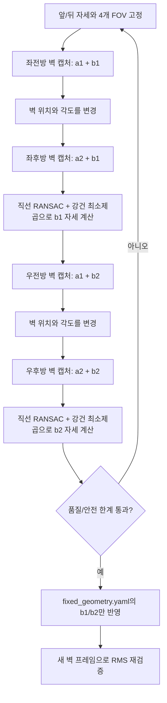

# lidar_fusion_v2

기존 합성 구현에 의존하지 않는 4대 2D LiDAR 통합 패키지이다. 앞(a1)·뒤(a2)를
고정 기준으로 두고, 좌(b1)·우(b2)의 장착 위치만 벽 관측으로 보정한다. 각
센서의 방향과 시야각은 설정 파일에서 한 번만 읽으며 프레임마다 변경하지 않는다.

## 입출력

| 구분 | 토픽 | 설명 |
|---|---|---|
| 입력 | `/lidar/a1/scan` | 정면 LaserScan |
| 입력 | `/lidar/a2/scan` | 후면 LaserScan |
| 입력 | `/lidar/b1/scan` | 좌측 LaserScan |
| 입력 | `/lidar/b2/scan` | 우측 LaserScan |
| 출력 | `/unified_lidar/cloud` | `base_link` 기준 통합 PointCloud2 |
| 출력 | `/unified_lidar/scan` | 각도별 최근접 점으로 만든 단일 LaserScan |
| 진단 | `/unified_lidar/raw/{a1,a2,b1,b2}` | 시야각 필터와 고정 외부 파라미터 적용 후, 합치기 전 센서별 점군 |

기본 설정은 정면 180°, 후면 140°, 좌·우 각각 110°의 시야각을 유지한다.
10 Hz 입력이 한두 프레임 늦어지는 경우에는 마지막 측정값을 최대 0.5초까지
유지해 RViz 시야가 순간적으로 사라지는 것을 막는다.

## 4대 라이다 통합 순서도



통합 cloud는 유효한 네 점군을 그대로 연결한다. 단일 scan은 겹치는 시야에서
동일 각도 bin에 여러 점이 들어오면 가장 가까운 거리 하나만 남긴다. 따라서
후속 노드는 센서 네 대를 별도로 처리하지 않고 `/unified_lidar/scan` 하나를
일반적인 360° 2D LiDAR처럼 사용할 수 있다.

## 빌드 및 실행 순서

1. 최초 1회 udev 규칙을 설치해 네 물리 포트를 고정한다.
2. 워크스페이스에서 패키지를 빌드하고 환경을 적용한다.
3. `bringup.launch.py`로 네 드라이버, 통합 노드와 전용 RViz를 실행한다.
4. 로그의 `active=['a1', 'a2', 'b1', 'b2']`를 확인한다.
5. 후속 인지 노드는 `/unified_lidar/scan` 또는 `/unified_lidar/cloud`만 구독한다.

```bash
# 최초 1회: 이 장비의 물리 USB 허브 위치를 앞/뒤/좌/우 이름으로 고정
sudo cp src/lidar_fusion_v2/tools/99-fma-lidars.rules /etc/udev/rules.d/
sudo udevadm control --reload-rules
sudo udevadm trigger
ls -l /dev/lidar_front /dev/lidar_rear /dev/lidar_left /dev/lidar_right

source /opt/ros/humble/setup.bash
colcon build --packages-select lidar_fusion_v2 --symlink-install
source install/setup.bash
ros2 launch lidar_fusion_v2 bringup.launch.py
```

이 차량에서는 실기에서 인식한 USB 허브 위치를 아래처럼 **고정 배선**으로 사용한다.
케이블을 다른 포트로 옮기면 위치 이름과 실제 라이다가 달라질 수 있으므로 임의로
이동하지 않는다.

| 장착 위치 | 고정 장치 링크 | 고정 USB `ID_PATH` |
|---|---|---|
| 앞 a1 | `/dev/lidar_front` | `pci-0000:00:14.0-usb-0:1.3:1.0` |
| 뒤 a2 | `/dev/lidar_rear` | `pci-0000:00:14.0-usb-0:1.2:1.0` |
| 좌 b1 | `/dev/lidar_left` | `pci-0000:00:14.0-usb-0:1.1:1.0` |
| 우 b2 | `/dev/lidar_right` | `pci-0000:00:14.0-usb-0:1.4.1:1.0` |

허브나 메인보드를 교체해 `ID_PATH` 자체가 달라진 경우에만 네 라이다의 물리 위치를
다시 식별한 뒤 `tools/99-fma-lidars.rules`를 함께 갱신한다.

소스 트리의 실행 스크립트를 사용하면 빌드부터 한 명령으로 실행할 수 있다.

```bash
src/lidar_fusion_v2/tools/run_4lidar_v2.sh --build
```

`bringup.launch.py`와 위 스크립트는 기존 `multi_lidar_fusion` 노드나
`/lidar/merged_scan`, `/lidar/merged_cloud`를 실행하지 않는다. 네 드라이버가
이미 실행 중이거나 rosbag을 재생할 때는 드라이버 없이 처리 노드만 띄운다.

```bash
ros2 launch lidar_fusion_v2 fusion_v2.launch.py
```

RViz에는 통합 cloud와 센서별 진단 점군이 함께 등록되어 있다. 개별 표시가
필요하지 않으면 `Raw Front/Rear/Left/Right` 항목만 끄면 된다.

### 실기 드라이버 프로파일

네 센서는 모두 YDLiDAR T-mini Plus이고 `lidar_type=1`, `reversion=true`,
`inverted=false`, 230400 baud, 10 Hz를 사용한다. 실기 스트림 형식 차이는 아래처럼
고정되어 있다.

| 위치 | 장치 링크 | sample rate | fixed resolution | intensity |
|---|---|---:|---:|---:|
| 앞 a1 | `/dev/lidar_front` | 9K | true | 16 bit |
| 뒤 a2 | `/dev/lidar_rear` | 4K | false | 8 bit |
| 좌 b1 | `/dev/lidar_left` | 4K | false | 8 bit |
| 우 b2 | `/dev/lidar_right` | 4K | false | 8 bit |

특히 후면 a2에 a1의 9K/고정 해상도/16 bit 설정을 사용하면 실기에서 checksum
오류 뒤 데이터 스트림이 종료됐으므로 네 위치의 프로파일을 일괄 통일하지 않는다.

## 앞·뒤 기준 벽 보정 순서

앞·뒤 자세와 네 시야각은 고정하고, 좌·우의 `x`, `y`, `yaw`만 계산한다.



한쪽 자세를 계산하려면 서로 다른 각도의 평평한 벽 관측이 최소 2개 필요하다.
도구는 대응점 수, 벽 길이, 두 센서가 본 직선의 각도 차이와 보정량 안전 한계를
검사하며 품질이 부족하면 결과를 만들지 않는다.

```bash
# 좌측: 앞 기준 캡처 -> 벽 이동/회전 -> 뒤 기준 캡처 -> 계산
ros2 run lidar_fusion_v2 wall_calibrator capture --pair front_left
ros2 run lidar_fusion_v2 wall_calibrator capture --pair rear_left
ros2 run lidar_fusion_v2 wall_calibrator solve --side left

# 우측: 앞 기준 캡처 -> 벽 이동/회전 -> 뒤 기준 캡처 -> 계산
ros2 run lidar_fusion_v2 wall_calibrator capture --pair front_right
ros2 run lidar_fusion_v2 wall_calibrator capture --pair rear_right
ros2 run lidar_fusion_v2 wall_calibrator solve --side right
```

기본 캡처 파일은 `/tmp/lidar_wall_calibration.json`이다. 계산 결과 중 b1/b2의
`x`, `y`, `yaw_deg`만 `config/fixed_geometry.yaml`에 반영하고, a1/a2와 모든
`fov_min_deg`, `fov_max_deg`는 변경하지 않는다.

## 현재 실차 보정 결과

2026-09-01 벽 이동·각도 변경 시험으로 얻은 값이다.

| 센서 | x (m) | y (m) | yaw (deg) | 계산 RMS |
|---|---:|---:|---:|---:|
| b1 좌측 | 0.294739 | 0.171568 | 2.827857 | 9.9 mm |
| b2 우측 | 0.302170 | -0.224331 | -179.762631 | 6.5 mm |

반영 후 새 프레임 재검증 RMS는 좌측 12.3 mm, 우측 5.0 mm였다.
